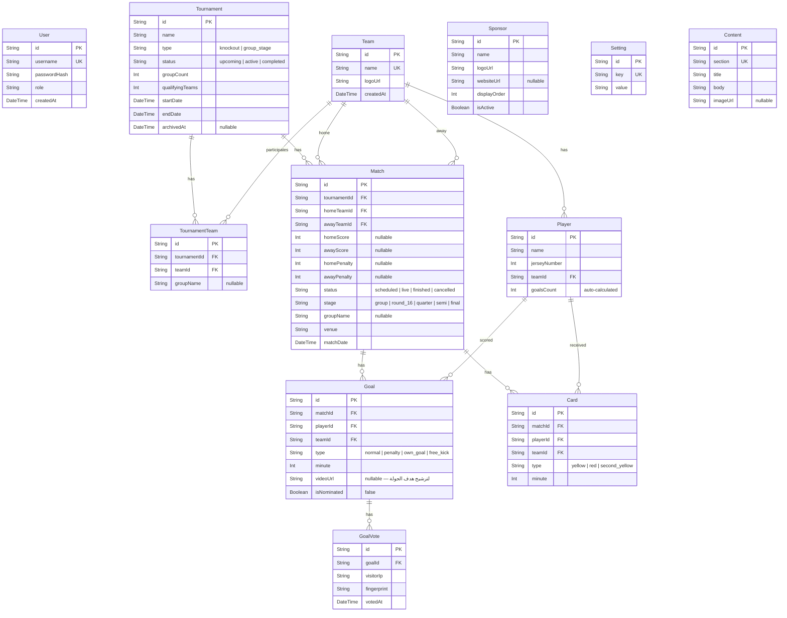
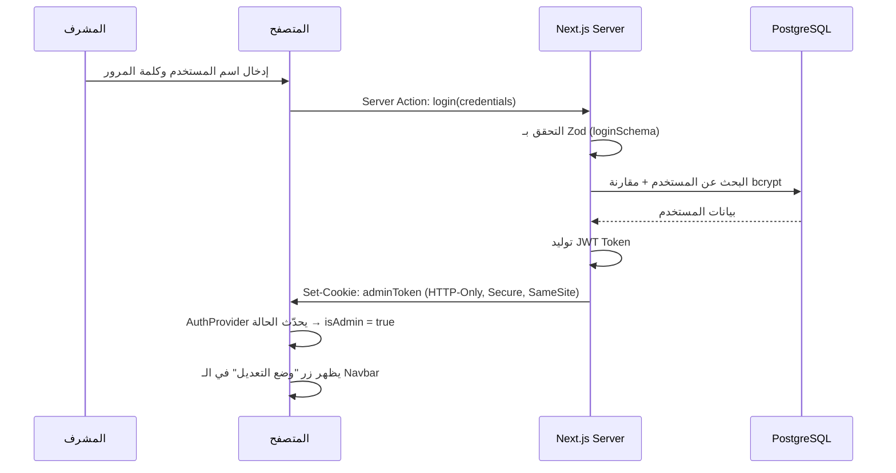

# 📋 الملف التنفيذي الشامل — مشروع نجوم الدوري (League Stars)

> **وثيقة تنفيذية واحدة شاملة** تحتوي كل ما يحتاجه المطور لبناء المشروع من الصفر حتى النشر.

---
---

# الفصل الأول: الرؤية والمكدس التقني

## 1.1 رؤية المشروع

موقع متكامل حديث للبطولات الكروية المحلية يقدم:
*   عرض مباشر للمباريات والنتائج والترتيب بالوقت الفعلي.
*   نظام تصويت تفاعلي لأفضل هدف بالجولة.
*   لوحة تحكم مدمجة سياقية للمشرفين دون الحاجة للوحة إدارية منفصلة.
*   هوية بصرية ديناميكية قابلة للتخصيص بالكامل من قاعدة البيانات.
*   أداء فائق وأرشفة قوية في محركات البحث (SEO) عبر Server-Side Rendering.

---

## 1.2 المكدس التقني المعتمد (Tech Stack)

| الطبقة | التقنية | النسخة |
| :--- | :--- | :---: |
| **الإطار الأساسي** | Next.js (App Router) | **15** |
| **اللغة** | TypeScript | أحدث |
| **التصميم** | Tailwind CSS | **4** |
| **مكونات UI** | shadcn/ui | أحدث |
| **قاعدة البيانات** | PostgreSQL | 16+ |
| **ORM** | Prisma | **6** |
| **التحقق من البيانات** | Zod | أحدث |
| **التخزين السحابي** | Cloudinary | — |
| **البث المباشر** | Server-Sent Events (SSE) | — |
| **بصمة المتصفح** | FingerprintJS | أحدث |
| **المصادقة** | JWT + HTTP-Only Cookies | — |
| **النشر** | Vercel | — |
| **الخط العربي** | Cairo (Google Fonts) | — |

---

## 1.3 القرارات المعمارية المعتمدة (Architectural Decisions)

| # | القرار | التفاصيل |
| :--- | :--- | :--- |
| **AD-1** | هيكلية المشروع | مشروع واحد متكامل (**Mono-repo**) يضم الفرونت والباك تحت Next.js |
| **AD-2** | نمط التنظيم | **Feature-Driven Development (FDD)** — تنظيم بالميزة وليس بالتصنيف التقني |
| **AD-3** | لوحة التحكم | مدمجة وسياقية (**Embedded & In-Context**) مع "وضع التعديل" (Edit Mode) |
| **AD-4** | حماية التصويت | IP + Browser Fingerprinting (بدون تسجيل دخول للجمهور) |
| **AD-5** | البث المباشر | **SSE** عبر Route Handlers + ReadableStream (متوافق مع Vercel بدون خادم إضافي) |
| **AD-6** | إدارة الحالة | **React Context** + `useReducer` عبر `AuthProvider` و `EditModeProvider` |
| **AD-7** | Caching | `revalidatePath()` + `revalidateTag()` بعد كل Server Action يُعدّل بيانات |

---
---

# الفصل الثاني: هيكل المجلدات (Folder Structure)

```text
league-stars-new/
├── prisma/
│   ├── schema.prisma                # مخطط الجداول والعلاقات الكامل
│   └── seed.ts                      # بيانات اختبارية شاملة (تشمل سيناريوهات كسر التعادل)
│
├── public/                          # الأصول الثابتة (شعارات، أيقونات)
│
└── src/
    ├── app/                         # ═══ طبقة التوجيه فقط (Thin Routing Layer) ═══
    │   ├── api/
    │   │   ├── auth/route.ts        # ممر تسجيل الدخول / التحقق من التوكن
    │   │   ├── vote/route.ts        # ممر استقبال الأصوات
    │   │   └── live/route.ts        # SSE endpoint — ReadableStream للبث المباشر
    │   │
    │   ├── matches/page.tsx         # → يستورد <MatchesPage /> فقط
    │   ├── scorers/page.tsx         # → يستورد <ScorersPage /> فقط
    │   ├── layout.tsx               # الخطوط + ميتا البيانات + Providers الجذرية
    │   └── page.tsx                 # → يستورد <LandingPage /> فقط
    │
    ├── features/                    # ═══ طبقة الميزات المستقلة (Feature Modules) ═══
    │   │
    │   ├── auth/                    # ── 1. المصادقة والأمان ──
    │   │   ├── actions.ts           #    Server Actions: login, logout
    │   │   ├── schemas.ts           #    Zod: loginSchema
    │   │   └── components/          #    LoginForm, LoginPage
    │   │
    │   ├── matches/                 # ── 2. المباريات والنتائج ──
    │   │   ├── actions.ts           #    Server Actions: createMatch, updateScore (+revalidateTag)
    │   │   ├── schemas.ts           #    Zod: createMatchSchema, updateScoreSchema
    │   │   ├── types.ts             #    Match, MatchStatus, StandingsRow
    │   │   ├── lib/
    │   │   │   └── standings-engine.ts  # خوارزمية الترتيب وكسر التعادل (7 مستويات)
    │   │   ├── hooks/
    │   │   │   └── use-live-score.ts    # EventSource hook للبث المباشر
    │   │   └── components/          #    MatchCard, MatchEditModal, StandingsTable
    │   │
    │   ├── teams/                   # ── 3. إدارة الفرق ──
    │   │   ├── actions.ts           #    CRUD + رفع الشعار (+revalidateTag)
    │   │   ├── schemas.ts           #    Zod: createTeamSchema, updateTeamSchema
    │   │   └── components/          #    TeamList, TeamForm, TeamCard
    │   │
    │   ├── players/                 # ── 4. اللاعبين والهدافين ──
    │   │   ├── actions.ts           #    CRUD + فحص تفرد رقم القميص (+revalidateTag)
    │   │   ├── schemas.ts           #    Zod: createPlayerSchema
    │   │   └── components/          #    ScorersTable, PlayerForm, PlayerAssignModal
    │   │
    │   ├── voting/                  # ── 5. تصويت الأهداف ──
    │   │   ├── actions.ts           #    submitVote, getVoteStats
    │   │   ├── schemas.ts           #    Zod: submitVoteSchema
    │   │   ├── hooks/
    │   │   │   └── use-fingerprint.ts   # توليد البصمة الرقمية للجهاز
    │   │   └── components/          #    GoalGallery, VoteButton, VoteStats
    │   │
    │   └── settings/                # ── 6. التحكم بالمظهر والمحتوى (CMS) ──
    │       ├── actions.ts           #    updateColors, updateHero, updateLogo (+revalidateTag)
    │       ├── schemas.ts           #    Zod: updateSettingsSchema, updateHeroSchema
    │       └── components/          #    ColorPicker, HeroEditModal, LogoUploader
    │
    ├── core/                        # ═══ الأدوات والمكونات المشتركة ═══
    │   ├── components/              #    UI مشتركة: Button, Dialog, Card, Spinner, EmptyState
    │   ├── layouts/                 #    Navbar, Footer, MobileNav
    │   ├── providers/
    │   │   ├── auth-provider.tsx    #    React Context: جلسة المشرف + useAuth() hook
    │   │   └── edit-mode-provider.tsx #  React Context: وضع التعديل + useEditMode() hook
    │   ├── theme/
    │   │   └── theme-provider.tsx   #    ThemeProvider: تحميل وتطبيق ألوان HSL من قاعدة البيانات
    │   └── lib/
    │       ├── prisma.ts            #    Prisma Client singleton
    │       ├── cloudinary.ts        #    Cloudinary client config
    │       ├── validation.ts        #    دوال تحقق مشتركة (parseFormData, validateSchema)
    │       └── errors.ts            #    ApiError class + handleActionError + formatZodErrors
    │
    └── styles/
        └── globals.css              #    متغيرات CSS (HSL) + Tailwind base + استيراد الخط
```

> [!TIP]
> **قاعدة ذهبية:** ملفات `src/app/` تحتوي فقط على التوجيه واستيراد المكونات — **كل المنطق والواجهات في `features/` و `core/`**.

---
---

# الفصل الثالث: مخطط قاعدة البيانات (Database Schema)

## 3.1 الجداول والعلاقات



## 3.2 القيود الهامة (Constraints)

| القيد | الجدول | التفاصيل |
| :--- | :--- | :--- |
| **تفرد رقم القميص** | `Player` | `@@unique([teamId, jerseyNumber])` — لا يمكن تكرار الرقم في نفس الفريق |
| **تفرد التصويت** | `GoalVote` | `@@unique([goalId, fingerprint])` — صوت واحد لكل جهاز لكل هدف |
| **منع مباراة ذاتية** | `Match` | فحص برمجي: `homeTeamId !== awayTeamId` |
| **حذف متتابع** | `Goal, Card` | `onDelete: Cascade` — حذف المباراة يحذف أهدافها وبطاقاتها |
| **تفرد المفتاح** | `Setting` | `key @unique` — مفتاح واحد لكل إعداد |

---
---

# الفصل الرابع: الأنظمة الأساسية (Core Systems)

## 4.1 نظام المصادقة والأمان (Authentication & Security)

### تدفق تسجيل الدخول



### طبقات الحماية

| الطبقة | الآلية | الملف |
| :--- | :--- | :--- |
| **1. التحقق من الإدخال** | Zod schema validation لكل Server Action | `features/*/schemas.ts` |
| **2. Middleware** | فحص JWT من الكوكيز في كل طلب للمسارات المحمية | `src/middleware.ts` |
| **3. Server Actions** | التحقق من التوكن قبل أي عملية CRUD | `features/*/actions.ts` |
| **4. HTTP-Only Cookies** | منع JavaScript من قراءة التوكن (حماية XSS) | `core/lib/` |
| **5. Lazy Loading** | كود الإدارة لا يُحمَّل للزوار العاديين أصلاً | `next/dynamic` |

---

## 4.2 نظام لوحة التحكم المدمجة (Embedded Admin)

### المبدأ
بدلاً من لوحة تحكم منفصلة، يتم **دمج أدوات التعديل مباشرة** في الصفحات العامة وتظهر فقط عند تفعيل "وضع التعديل".

### آلية العمل

```tsx
// ═══ 1. EditModeProvider ═══
// src/core/providers/edit-mode-provider.tsx
'use client';
const EditModeContext = createContext({ isEditMode: false, toggle: () => {} });

export function EditModeProvider({ children }) {
  const [isEditMode, setIsEditMode] = useState(false);
  return (
    <EditModeContext.Provider value={{ isEditMode, toggle: () => setIsEditMode(prev => !prev) }}>
      {children}
    </EditModeContext.Provider>
  );
}
export const useEditMode = () => useContext(EditModeContext);
```

```tsx
// ═══ 2. مكون مشترك: كرت المباراة ═══
// src/features/matches/components/match-card.tsx
import dynamic from 'next/dynamic';
import { useEditMode } from '@/core/providers/edit-mode-provider';

// تحميل المودال الإداري بالطلب فقط (لا يُحمَّل للزوار)
const MatchEditModal = dynamic(() => import('./match-edit-modal'), { ssr: false });

export default function MatchCard({ match }) {
  const { isEditMode } = useEditMode();
  const [showModal, setShowModal] = useState(false);

  return (
    <div className="relative border p-4 rounded-xl">
      <div>{match.homeTeam} VS {match.awayTeam}</div>
      <div>{match.homeScore} - {match.awayScore}</div>

      {/* ✏️ يظهر فقط في وضع التعديل */}
      {isEditMode && (
        <button onClick={() => setShowModal(true)} className="absolute top-2 right-2">
          <EditIcon />
        </button>
      )}

      {showModal && <MatchEditModal match={match} onClose={() => setShowModal(false)} />}
    </div>
  );
}
```

```tsx
// ═══ 3. تأمين Server Action ═══
// src/features/matches/actions.ts
'use server';
import { revalidateTag } from 'next/cache';
import { verifyAdmin } from '@/core/lib/auth';
import { updateScoreSchema } from './schemas';

export async function updateMatchScore(formData: FormData) {
  // 🔒 الحماية الأولى: التحقق من الصلاحية
  await verifyAdmin(); // يرمي خطأ إذا لم يكن أدمن

  // 🔒 الحماية الثانية: التحقق من صحة البيانات
  const data = updateScoreSchema.parse(Object.fromEntries(formData));

  // ✅ تنفيذ العملية
  await prisma.match.update({ where: { id: data.matchId }, data: { ... } });

  // 🔄 إبطال الكاش فوراً
  revalidateTag('matches');
  revalidateTag('standings');
  revalidateTag('scorers');
}
```

> [!CAUTION]
> **الأمان الحقيقي في السيرفر دائماً.** حتى لو عرض مستخدم خبيث أزرار التعديل عبر CSS، لن يستطيع تنفيذ أي عملية بدون JWT صحيح يُفحص في `verifyAdmin()`.

---

## 4.3 نظام البث المباشر (SSE — Server-Sent Events)

### لماذا SSE وليس WebSocket؟
*   **Vercel لا يدعم WebSocket** — يحتاج خادم منفصل.
*   **SSE يعمل مع Vercel** عبر Route Handlers + ReadableStream.
*   **إعادة الاتصال التلقائي** مدمجة في `EventSource` API.
*   **أحادي الاتجاه** (سيرفر ← عميل) وهو كافٍ لعرض النتائج المباشرة.

### آلية العمل

```tsx
// ═══ SSE Endpoint ═══
// src/app/api/live/route.ts
export async function GET() {
  const stream = new ReadableStream({
    start(controller) {
      const encoder = new TextEncoder();

      // إرسال نبضة كل 30 ثانية للحفاظ على الاتصال
      const heartbeat = setInterval(() => {
        controller.enqueue(encoder.encode(': heartbeat\n\n'));
      }, 30000);

      // الاستماع لتحديثات النتائج (عبر آلية pub/sub داخلية أو polling)
      const onUpdate = (data) => {
        controller.enqueue(encoder.encode(`data: ${JSON.stringify(data)}\n\n`));
      };

      // تنظيف عند إغلاق الاتصال
      return () => clearInterval(heartbeat);
    },
  });

  return new Response(stream, {
    headers: {
      'Content-Type': 'text/event-stream',
      'Cache-Control': 'no-cache',
      'Connection': 'keep-alive',
    },
  });
}
```

```tsx
// ═══ useLiveScore Hook ═══
// src/features/matches/hooks/use-live-score.ts
'use client';
export function useLiveScore(matchId: string) {
  const [score, setScore] = useState(null);

  useEffect(() => {
    const source = new EventSource('/api/live');

    source.onmessage = (event) => {
      const data = JSON.parse(event.data);
      if (data.matchId === matchId) setScore(data);
    };

    return () => source.close();
  }, [matchId]);

  return score;
}
```

---

## 4.4 خوارزمية كسر التعادل (Standings Tie-Breaker Engine)

### الموقع: `src/features/matches/lib/standings-engine.ts`

### مستويات الفرز (بالترتيب)

| الأولوية | المعيار | الوصف |
| :---: | :--- | :--- |
| **1** | النقاط الإجمالية | فوز = 3، تعادل = 1، خسارة = 0 |
| **2** | المواجهات المباشرة (H2H Points) | النقاط بين الفرق المتعادلة فقط |
| **3** | فارق أهداف المواجهات المباشرة (H2H GD) | فارق الأهداف في المباريات المباشرة فقط |
| **4** | فارق الأهداف الإجمالي (Overall GD) | (له - عليه) في جميع مباريات المجموعة |
| **5** | الأهداف المسجلة إجمالاً | إجمالي الأهداف المسجلة |
| **6** | نقاط اللعب النظيف | أصفر = -1، أحمر غير مباشر = -3، أحمر مباشر = -4 |
| **7** | القرعة | الخيار النهائي |

### Pseudocode

```text
function sortStandings(teams[], matches[], cards[]):
  1. حساب النقاط الإجمالية لكل فريق من نتائج المباريات
  2. تجميع الفرق المتعادلة في النقاط في مجموعات فرعية
  3. لكل مجموعة متعادلة:
     a. تصفية المباريات المباشرة بينهم فقط
     b. حساب نقاط المواجهات المباشرة → إذا اختلفت → فرز
     c. حساب فارق أهداف المواجهات المباشرة → إذا اختلف → فرز
     d. حساب فارق الأهداف الإجمالي → إذا اختلف → فرز
     e. حساب الأهداف المسجلة إجمالاً → إذا اختلف → فرز
     f. حساب نقاط اللعب النظيف (البطاقات) → إذا اختلفت → فرز
     g. القرعة (ترتيب يدوي من المشرف)
  4. إرجاع الترتيب النهائي
```

---

## 4.5 طبقة التحقق والأخطاء الموحدة (Validation & Error Handling)

### ملف التحقق المشترك: `src/core/lib/validation.ts`

```typescript
import { ZodSchema, ZodError } from 'zod';

export function validateAction<T>(schema: ZodSchema<T>, data: unknown): T {
  try {
    return schema.parse(data);
  } catch (error) {
    if (error instanceof ZodError) {
      throw new ActionError('VALIDATION_ERROR', formatZodErrors(error));
    }
    throw error;
  }
}

function formatZodErrors(error: ZodError): string {
  return error.errors.map(e => `${e.path.join('.')}: ${e.message}`).join(', ');
}
```

### ملف الأخطاء: `src/core/lib/errors.ts`

```typescript
export class ActionError extends Error {
  constructor(public code: string, message: string) {
    super(message);
  }
}

export function handleActionError(error: unknown) {
  if (error instanceof ActionError) {
    return { success: false, error: error.message, code: error.code };
  }
  console.error('Unexpected error:', error);
  return { success: false, error: 'حدث خطأ غير متوقع', code: 'INTERNAL_ERROR' };
}
```

### نمط استخدام موحد في كل Server Action

```typescript
'use server';
export async function createTeam(formData: FormData) {
  try {
    await verifyAdmin();
    const data = validateAction(createTeamSchema, Object.fromEntries(formData));
    const team = await prisma.team.create({ data });
    revalidateTag('teams');
    return { success: true, data: team };
  } catch (error) {
    return handleActionError(error);
  }
}
```

---

## 4.6 إدارة الحالة المشتركة (State Management)

| Provider | الملف | الـ Hook | الوظيفة |
| :--- | :--- | :--- | :--- |
| **AuthProvider** | `core/providers/auth-provider.tsx` | `useAuth()` | يوفر `isAdmin`, `user`, `logout()` |
| **EditModeProvider** | `core/providers/edit-mode-provider.tsx` | `useEditMode()` | يوفر `isEditMode`, `toggle()` |
| **ThemeProvider** | `core/theme/theme-provider.tsx` | `useTheme()` | يوفر الألوان الديناميكية من قاعدة البيانات |

### الترتيب في `layout.tsx`

```tsx
// src/app/layout.tsx
export default function RootLayout({ children }) {
  return (
    <html lang="ar" dir="rtl">
      <body className={cairoFont.className}>
        <AuthProvider>
          <EditModeProvider>
            <ThemeProvider>
              <Navbar />
              <main>{children}</main>
              <Footer />
            </ThemeProvider>
          </EditModeProvider>
        </AuthProvider>
      </body>
    </html>
  );
}
```

---

## 4.7 استراتيجية Caching & Revalidation

### خريطة Tags المعتمدة

| الـ Tag | يُستخدم في الصفحات | يُبطل عند |
| :--- | :--- | :--- |
| `standings` | صفحة الترتيب، الرئيسية | تحديث نتيجة مباراة، إضافة بطاقة |
| `scorers` | صفحة الهدافين | تسجيل هدف جديد |
| `matches` | جدول المباريات، الرئيسية | إضافة / تعديل / حذف مباراة |
| `teams` | قائمة الفرق، جدول المباريات | إضافة / تعديل فريق |
| `settings` | جميع الصفحات (الألوان، الشعار، الهيرو) | تعديل أي إعداد عام |
| `sponsors` | شريط الرعاة | إضافة / تعديل / حذف راعٍ |

### نمط الاستخدام في Server Components

```tsx
// جلب البيانات مع تفعيل Caching by Tag
const matches = await prisma.match.findMany({ ... });
// في fetch: { next: { tags: ['matches'] } }
```

---
---

# الفصل الخامس: نظام التصميم والهوية البصرية (Design System)

## 5.1 لوحة الألوان (ديناميكية من قاعدة البيانات)

| اللون | الاستخدام | القيمة الافتراضية | متغير CSS |
| :--- | :--- | :--- | :--- |
| **الأساسي** | الأزرار، الروابط، الهيدر | `#750722` (عنابي) | `--primary` |
| **النص الداكن** | النصوص الأساسية | `#2c3e50` | `--text-color` |
| **التأكيد** | VS، البث المباشر، الأزرار النشطة | `#C92142` (قرمزي) | `--accent` |
| **الخلفية** | خلفية الصفحات | `#f8f9fa` | `--background` |
| **الحدود** | تقسيم المساحات | `#e9ecef` | `--border` |

> [!TIP]
> يتم تخزين الألوان كقيم HSL في جدول `Setting` وتحميلها عبر `ThemeProvider` وتطبيقها على `document.documentElement` كمتغيرات CSS مخصصة.

## 5.2 الخط والتصميم العام
*   **الخط:** Cairo (Google Fonts) — عربي عصري وواضح.
*   **الطابع:** رياضي فخم ومهيب.
*   **التأثيرات:** AOS (fade-up, zoom-in) + micro-animations عند hover.
*   **التجاوب:**
    *   **سطح المكتب:** جداول بعرض مقسم بدقة.
    *   **الجوال:** بطاقات عريضة (`mobile-match-card`) للقراءة باللمس.

## 5.3 حالات الواجهة (UI States)

| الحالة | العرض | السلوك |
| :--- | :--- | :--- |
| **زائر** | المباريات + الرعاة + الهدافين + التصويت | اطلاع فقط + تصويت لمرة واحدة |
| **مشرف (عادي)** | نفس الزائر + زر "وضع التعديل" | تصفح كزائر لمعاينة الشكل |
| **مشرف (وضع التعديل)** | أيقونات ✏️ و 🗑️ على كل عنصر قابل للتعديل | CRUD كامل عبر Modals سياقية |
| **تحميل** | Spinner + إخفاء المحتوى | Fade In عند اكتمال الجلب |
| **فارغة** | أيقونة + نص توضيحي + زر توجيه | "لا توجد مباريات اليوم" |

---
---

# الفصل السادس: الميزات الوظيفية الكاملة (Feature Specifications)

## 6.1 نظام البطولات
*   إنشاء بطولة بنوعها (خروج مغلوب / مجموعات + خروج مغلوب).
*   تحديد التواريخ وعدد المجموعات والفرق المتأهلة.
*   ربط الفرق المشاركة ديناميكياً.
*   **إنهاء وأرشفة البطولة:** إتاحة خيار "إنهاء البطولة" للمشرف، والذي يغير حالة البطولة إلى `completed` ويسجل تاريخ الأرشفة في `archivedAt` للحفاظ على سجلها التاريخي وعرضه مستقبلاً في معرض البطولات.

## 6.2 إدارة الفرق واللاعبين
*   CRUD للفرق مع رفع الشعار إلى Cloudinary.
*   CRUD للاعبين مع التحقق من تفرد رقم القميص (`@@unique([teamId, jerseyNumber])`).
*   البحث والتصفية بالاسم والفريق.

## 6.3 جدول المباريات والنتائج
*   جدولة المباريات بكامل تفاصيلها (البطولة، الفرق، التاريخ، الملعب).
*   تحديث الحالة (scheduled → live → finished / cancelled).
*   تسجيل الأهداف والبطاقات + نتائج ركلات الترجيح.
*   التصفية حسب البطولة والحالة + البحث النصي.

## 6.4 الترتيب التلقائي للمجموعات
*   حساب النقاط والأهداف تلقائياً بعد كل مباراة.
*   تطبيق خوارزمية كسر التعادل (7 مستويات) عبر `standings-engine.ts`.
*   إبطال كاش الترتيب فوراً عبر `revalidateTag('standings')`.

## 6.5 قائمة الهدافين
*   حساب تلقائي من جدول `Goal`.
*   ترتيب تنازلي مع تمييز المراكز الثلاثة الأولى (ذهبي/فضي/برونزي).
*   تصفية حسب البطولة النشطة.

## 6.6 تصويت هدف الجولة
*   ترشيح الأهداف مع فيديو مدمج (YouTube/TikTok/Instagram).
*   تصويت محمي بـ IP + Browser Fingerprint (`@@unique([goalId, fingerprint])`).
*   عرض إحصائيات التصويت (نسب مئوية) في الوقت الفعلي.

## 6.7 تخصيص الهوية البصرية (CMS)
*   تعديل قسم البطل (Hero): العنوان، الوصف، الصورة، ألوان النصوص.
*   تغيير الألوان الأساسية (Primary, Text) — تُطبق فوراً عبر CSS variables.
*   رفع شعار جديد يظهر تلقائياً في الهيدر والفوتر.
*   تحديث روابط التواصل الاجتماعي.
*   تعديل نصوص "من نحن" والرؤية.

---
---

# الفصل السابع: مراحل التنفيذ وقائمة المهام (Execution Phases & Checklist)

## جدول المراحل الموجز

| المرحلة | الأهداف | المخرجات |
| :--- | :--- | :--- |
| **1. البنية التحتية** | PostgreSQL + Prisma 6 + Zod + Error Handling + Seed | اتصال DB + Middleware أمني + بيانات اختبارية |
| **2. الخلفية والمصادقة** | JWT Auth + Server Actions + Cloudinary + Revalidation | CRUD Actions مؤمنة + Zod schemas لكل feature |
| **3. الواجهات + محرك الترتيب** | نظام التصميم + Providers + standings-engine + صفحات SSR | واجهة كاملة + خوارزمية ترتيب مُختبرة |
| **4. التعديل والتفاعل** | Edit Mode + Inline Modals + Voting + SSE | أدمن مدمج + تصويت محمي + بث مباشر |
| **5. الاختبار والنشر** | تجاوب + أمان + Caching + SEO + Vercel | موقع منشور + DB سحابية |

---

## المرحلة 1: التأسيس وإعداد قاعدة البيانات

- [ ] إنشاء هيكل مشروع Next.js 15 متكامل بـ TypeScript
- [ ] إعداد Tailwind CSS 4 ومكونات shadcn/ui وربط الخط العربي Cairo
- [ ] تثبيت Prisma 6 ORM وتوصيله بقاعدة بيانات PostgreSQL
- [ ] تثبيت Zod وإنشاء `src/core/lib/validation.ts`
- [ ] إنشاء `src/core/lib/errors.ts` (ApiError, handleActionError)
- [ ] كتابة `schema.prisma` بالجداول:
    - [ ] `User` (المشرفين)
    - [ ] `Tournament` (مع إضافة حقل `archivedAt` للأرشفة والإنهاء)
    - [ ] `Team`
    - [ ] `Player` (مع ربطه بالفريق + `@@unique([teamId, jerseyNumber])`)
    - [ ] `Match` (النتائج + الترجيح + الحالة)
    - [ ] `Goal` (المسجلين + النوع + `videoUrl` + `isNominated`)
    - [ ] `Card` (الإنذارات + الطرد)
    - [ ] `GoalVote` (`@@unique([goalId, fingerprint])`)
    - [ ] `Sponsor`
    - [ ] `Setting` + `Content`
- [ ] إنشاء `prisma/seed.ts`:
    - [ ] مستخدم مشرف افتراضي
    - [ ] بطولة بمجموعتين + فرق متعادلة في النقاط بمواجهات مباشرة مختلفة
    - [ ] بطاقات صفراء وحمراء متنوعة
- [ ] تشغيل `npx prisma migrate dev`

---

## المرحلة 2: تطوير الخلفية والمصادقة

- [ ] تطوير JWT Auth + حفظ التوكن في HTTP-Only Cookies
- [ ] بناء Middleware للتحقق من هوية المشرف
- [ ] إنشاء Zod schemas:
    - [ ] `features/auth/schemas.ts` → `loginSchema`
    - [ ] `features/matches/schemas.ts` → `createMatchSchema`, `updateScoreSchema`
    - [ ] `features/teams/schemas.ts` → `createTeamSchema`
    - [ ] `features/players/schemas.ts` → `createPlayerSchema`
    - [ ] `features/voting/schemas.ts` → `submitVoteSchema`
    - [ ] `features/settings/schemas.ts` → `updateSettingsSchema`
    - [ ] `features/tournaments/schemas.ts` → `createTournamentSchema`, `updateTournamentSchema`
- [ ] تطوير Server Actions للبطولات (إنشاء، تعديل، إنهاء وأرشفة البطولة `archiveTournament`)
- [ ] تطوير Server Actions مع `revalidatePath` / `revalidateTag`
- [ ] ربط Cloudinary لرفع الشعارات والوسائط
- [ ] تطوير Server Actions لإدارة اللاعبين + فحص تفرد رقم القميص
- [ ] تطوير منطق تحديث نتائج المباريات وحالاتها

---

## المرحلة 3: بناء الواجهات + محرك الترتيب

- [ ] إعداد نظام ألوان HSL الديناميكي مع Tailwind CSS 4
- [ ] إنشاء `AuthProvider` (`core/providers/auth-provider.tsx`)
- [ ] إنشاء `EditModeProvider` (`core/providers/edit-mode-provider.tsx`)
- [ ] تغليف `layout.tsx` بالـ Providers (Auth + EditMode + Theme)
- [ ] تطوير الهيدر والفوتر والروابط الاجتماعية الديناميكية
- [ ] **كتابة `standings-engine.ts`** (خوارزمية كسر التعادل — 7 مستويات)
- [ ] بناء الصفحة الرئيسية (البطل + مباريات اليوم + الرعاة + من نحن)
- [ ] بناء صفحة جدول المباريات + الترتيب التلقائي (يستخدم standings-engine)
- [ ] بناء صفحة أفضل الهدافين (ذهبي/فضي/برونزي للمراكز الأولى)
- [ ] بناء صفحة معرض أهداف الجولة (فيديوهات + نسب تصويت)

---

## المرحلة 4: أدوات التعديل والميزات التفاعلية

- [ ] بناء صفحة تسجيل دخول المشرف
- [ ] إضافة مفتاح "وضع التعديل" في الـ Navbar
- [ ] تطوير Inline Edit Modals عبر `next/dynamic` (lazy loading)
- [ ] تمكين وضع التعديل على: كروت المباريات، الرعاة، البطل، الهدافين
- [ ] تطبيق Browser Fingerprinting في واجهة التصويت
- [ ] **تفعيل SSE:**
    - [ ] `src/app/api/live/route.ts` → ReadableStream
    - [ ] `src/features/matches/hooks/use-live-score.ts` → EventSource
    - [ ] ربط تحديث النتائج بأحداث SSE

---

## المرحلة 5: التدقيق والنشر

- [ ] اختبار التجاوب (Mobile + Tablet + Desktop)
- [ ] **اختبار خوارزمية كسر التعادل** ببيانات Seed المُعدّة
- [ ] فحص حماية الممرات الإدارية (صد بدون توكن)
- [ ] اختبار التصويت (منع تكرار الأصوات)
- [ ] **فحص Caching/Revalidation** (تحديث فوري بعد كل تعديل)
- [ ] فحص SEO Core Web Vitals
- [ ] نشر على Vercel + قاعدة بيانات PostgreSQL سحابية مؤمنة

---
---

> [!NOTE]
> **هذه الوثيقة هي المرجع الوحيد والشامل للمشروع.** تحتوي كل قرار معماري، كل ملف ومكان وجوده، كل خوارزمية وكل مهمة مطلوبة. يمكن البدء بالتنفيذ مباشرة من المرحلة الأولى.
