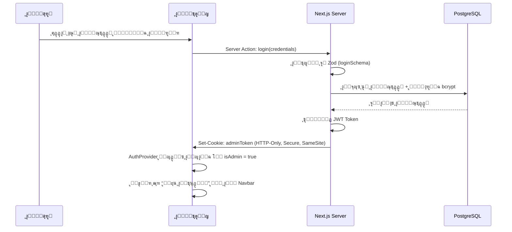

# ๐Ÿ“‹ ุงู„ู…ู„ู ุงู„ุชู†ููŠุฐูŠ ุงู„ุดุงู…ู„ โ€” ู…ุดุฑูˆุน ู†ุฌูˆู… ุงู„ุฏูˆุฑูŠ (League Stars)

> **ูˆุซูŠู‚ุฉ ุชู†ููŠุฐูŠุฉ ูˆุงุญุฏุฉ ุดุงู…ู„ุฉ** ุชุญุชูˆูŠ ูƒู„ ู…ุง ูŠุญุชุงุฌู‡ ุงู„ู…ุทูˆุฑ ู„ุจู†ุงุก ุงู„ู…ุดุฑูˆุน ู…ู† ุงู„ุตูุฑ ุญุชู‰ ุงู„ู†ุดุฑ.

---
---

# ุงู„ูุตู„ ุงู„ุฃูˆู„: ุงู„ุฑุคูŠุฉ ูˆุงู„ู…ูƒุฏุณ ุงู„ุชู‚ู†ูŠ

## 1.1 ุฑุคูŠุฉ ุงู„ู…ุดุฑูˆุน

ู…ูˆู‚ุน ู…ุชูƒุงู…ู„ ุญุฏูŠุซ ู„ู„ุจุทูˆู„ุงุช ุงู„ูƒุฑูˆูŠุฉ ุงู„ู…ุญู„ูŠุฉ ูŠู‚ุฏู…:
*   ุนุฑุถ ู…ุจุงุดุฑ ู„ู„ู…ุจุงุฑูŠุงุช ูˆุงู„ู†ุชุงุฆุฌ ูˆุงู„ุชุฑุชูŠุจ ุจุงู„ูˆู‚ุช ุงู„ูุนู„ูŠ.
*   ู†ุธุงู… ุชุตูˆูŠุช ุชูุงุนู„ูŠ ู„ุฃูุถู„ ู‡ุฏู ุจุงู„ุฌูˆู„ุฉ.
*   ู„ูˆุญุฉ ุชุญูƒู… ู…ุฏู…ุฌุฉ ุณูŠุงู‚ูŠุฉ ู„ู„ู…ุดุฑููŠู† ุฏูˆู† ุงู„ุญุงุฌุฉ ู„ู„ูˆุญุฉ ุฅุฏุงุฑูŠุฉ ู…ู†ูุตู„ุฉ.
*   ู‡ูˆูŠุฉ ุจุตุฑูŠุฉ ุฏูŠู†ุงู…ูŠูƒูŠุฉ ู‚ุงุจู„ุฉ ู„ู„ุชุฎุตูŠุต ุจุงู„ูƒุงู…ู„ ู…ู† ู‚ุงุนุฏุฉ ุงู„ุจูŠุงู†ุงุช.
*   ุฃุฏุงุก ูุงุฆู‚ ูˆุฃุฑุดูุฉ ู‚ูˆูŠุฉ ููŠ ู…ุญุฑูƒุงุช ุงู„ุจุญุซ (SEO) ุนุจุฑ Server-Side Rendering.

---

## 1.2 ุงู„ู…ูƒุฏุณ ุงู„ุชู‚ู†ูŠ ุงู„ู…ุนุชู…ุฏ (Tech Stack)

| ุงู„ุทุจู‚ุฉ | ุงู„ุชู‚ู†ูŠุฉ | ุงู„ู†ุณุฎุฉ |
| :--- | :--- | :---: |
| **ุงู„ุฅุทุงุฑ ุงู„ุฃุณุงุณูŠ** | Next.js (App Router) | **15** |
| **ุงู„ู„ุบุฉ** | TypeScript | ุฃุญุฏุซ |
| **ุงู„ุชุตู…ูŠู…** | Tailwind CSS | **4** |
| **ู…ูƒูˆู†ุงุช UI** | shadcn/ui | ุฃุญุฏุซ |
| **ู‚ุงุนุฏุฉ ุงู„ุจูŠุงู†ุงุช** | PostgreSQL | 16+ |
| **ORM** | Prisma | **6** |
| **ุงู„ุชุญู‚ู‚ ู…ู† ุงู„ุจูŠุงู†ุงุช** | Zod | ุฃุญุฏุซ |
| **ุงู„ุชุฎุฒูŠู† ุงู„ุณุญุงุจูŠ** | Cloudinary | โ€” |
| **ุงู„ุจุซ ุงู„ู…ุจุงุดุฑ** | Server-Sent Events (SSE) | โ€” |
| **ุจุตู…ุฉ ุงู„ู…ุชุตูุญ** | FingerprintJS | ุฃุญุฏุซ |
| **ุงู„ู…ุตุงุฏู‚ุฉ** | JWT + HTTP-Only Cookies | โ€” |
| **ุงู„ู†ุดุฑ** | Vercel | โ€” |
| **ุงู„ุฎุท ุงู„ุนุฑุจูŠ** | Cairo (Google Fonts) | โ€” |

---

## 1.3 ุงู„ู‚ุฑุงุฑุงุช ุงู„ู…ุนู…ุงุฑูŠุฉ ุงู„ู…ุนุชู…ุฏุฉ (Architectural Decisions)

| # | ุงู„ู‚ุฑุงุฑ | ุงู„ุชูุงุตูŠู„ |
| :--- | :--- | :--- |
| **AD-1** | ู‡ูŠูƒู„ูŠุฉ ุงู„ู…ุดุฑูˆุน | ู…ุดุฑูˆุน ูˆุงุญุฏ ู…ุชูƒุงู…ู„ (**Mono-repo**) ูŠุถู… ุงู„ูุฑูˆู†ุช ูˆุงู„ุจุงูƒ ุชุญุช Next.js |
| **AD-2** | ู†ู…ุท ุงู„ุชู†ุธูŠู… | **Feature-Driven Development (FDD)** โ€” ุชู†ุธูŠู… ุจุงู„ู…ูŠุฒุฉ ูˆู„ูŠุณ ุจุงู„ุชุตู†ูŠู ุงู„ุชู‚ู†ูŠ |
| **AD-3** | ู„ูˆุญุฉ ุงู„ุชุญูƒู… | ู…ุฏู…ุฌุฉ ูˆุณูŠุงู‚ูŠุฉ (**Embedded & In-Context**) ู…ุน "ูˆุถุน ุงู„ุชุนุฏูŠู„" (Edit Mode) |
| **AD-4** | ุญู…ุงูŠุฉ ุงู„ุชุตูˆูŠุช | IP + Browser Fingerprinting (ุจุฏูˆู† ุชุณุฌูŠู„ ุฏุฎูˆู„ ู„ู„ุฌู…ู‡ูˆุฑ) |
| **AD-5** | ุงู„ุจุซ ุงู„ู…ุจุงุดุฑ | **SSE** ุนุจุฑ Route Handlers + ReadableStream (ู…ุชูˆุงูู‚ ู…ุน Vercel ุจุฏูˆู† ุฎุงุฏู… ุฅุถุงููŠ) |
| **AD-6** | ุฅุฏุงุฑุฉ ุงู„ุญุงู„ุฉ | **React Context** + `useReducer` ุนุจุฑ `AuthProvider` ูˆ `EditModeProvider` |
| **AD-7** | Caching | `revalidatePath()` + `revalidateTag()` ุจุนุฏ ูƒู„ Server Action ูŠูุนุฏู‘ู„ ุจูŠุงู†ุงุช |

---
---

# ุงู„ูุตู„ ุงู„ุซุงู†ูŠ: ู‡ูŠูƒู„ ุงู„ู…ุฌู„ุฏุงุช (Folder Structure)

```text
league-stars-new/
โ”œโ”€โ”€ prisma/
โ”‚   โ”œโ”€โ”€ schema.prisma                # ู…ุฎุทุท ุงู„ุฌุฏุงูˆู„ ูˆุงู„ุนู„ุงู‚ุงุช ุงู„ูƒุงู…ู„
โ”‚   โ””โ”€โ”€ seed.ts                      # ุจูŠุงู†ุงุช ุงุฎุชุจุงุฑูŠุฉ ุดุงู…ู„ุฉ (ุชุดู…ู„ ุณูŠู†ุงุฑูŠูˆู‡ุงุช ูƒุณุฑ ุงู„ุชุนุงุฏู„)
โ”‚
โ”œโ”€โ”€ public/                          # ุงู„ุฃุตูˆู„ ุงู„ุซุงุจุชุฉ (ุดุนุงุฑุงุชุŒ ุฃูŠู‚ูˆู†ุงุช)
โ”‚
โ””โ”€โ”€ src/
    โ”œโ”€โ”€ app/                         # โ•โ•โ• ุทุจู‚ุฉ ุงู„ุชูˆุฌูŠู‡ ูู‚ุท (Thin Routing Layer) โ•โ•โ•
    โ”‚   โ”œโ”€โ”€ api/
    โ”‚   โ”‚   โ”œโ”€โ”€ auth/route.ts        # ู…ู…ุฑ ุชุณุฌูŠู„ ุงู„ุฏุฎูˆู„ / ุงู„ุชุญู‚ู‚ ู…ู† ุงู„ุชูˆูƒู†
    โ”‚   โ”‚   โ”œโ”€โ”€ vote/route.ts        # ู…ู…ุฑ ุงุณุชู‚ุจุงู„ ุงู„ุฃุตูˆุงุช
    โ”‚   โ”‚   โ””โ”€โ”€ live/route.ts        # SSE endpoint โ€” ReadableStream ู„ู„ุจุซ ุงู„ู…ุจุงุดุฑ
    โ”‚   โ”‚
    โ”‚   โ”œโ”€โ”€ matches/page.tsx         # โ†’ ูŠุณุชูˆุฑุฏ <MatchesPage /> ูู‚ุท
    โ”‚   โ”œโ”€โ”€ scorers/page.tsx         # โ†’ ูŠุณุชูˆุฑุฏ <ScorersPage /> ูู‚ุท
    โ”‚   โ”œโ”€โ”€ layout.tsx               # ุงู„ุฎุทูˆุท + ู…ูŠุชุง ุงู„ุจูŠุงู†ุงุช + Providers ุงู„ุฌุฐุฑูŠุฉ
    โ”‚   โ””โ”€โ”€ page.tsx                 # โ†’ ูŠุณุชูˆุฑุฏ <LandingPage /> ูู‚ุท
    โ”‚
    โ”œโ”€โ”€ features/                    # โ•โ•โ• ุทุจู‚ุฉ ุงู„ู…ูŠุฒุงุช ุงู„ู…ุณุชู‚ู„ุฉ (Feature Modules) โ•โ•โ•
    โ”‚   โ”‚
    โ”‚   โ”œโ”€โ”€ auth/                    # โ”€โ”€ 1. ุงู„ู…ุตุงุฏู‚ุฉ ูˆุงู„ุฃู…ุงู† โ”€โ”€
    โ”‚   โ”‚   โ”œโ”€โ”€ actions.ts           #    Server Actions: login, logout
    โ”‚   โ”‚   โ”œโ”€โ”€ schemas.ts           #    Zod: loginSchema
    โ”‚   โ”‚   โ””โ”€โ”€ components/          #    LoginForm, LoginPage
    โ”‚   โ”‚
    โ”‚   โ”œโ”€โ”€ matches/                 # โ”€โ”€ 2. ุงู„ู…ุจุงุฑูŠุงุช ูˆุงู„ู†ุชุงุฆุฌ โ”€โ”€
    โ”‚   โ”‚   โ”œโ”€โ”€ actions.ts           #    Server Actions: createMatch, updateScore (+revalidateTag)
    โ”‚   โ”‚   โ”œโ”€โ”€ schemas.ts           #    Zod: createMatchSchema, updateScoreSchema
    โ”‚   โ”‚   โ”œโ”€โ”€ types.ts             #    Match, MatchStatus, StandingsRow
    โ”‚   โ”‚   โ”œโ”€โ”€ lib/
    โ”‚   โ”‚   โ”‚   โ””โ”€โ”€ standings-engine.ts  # ุฎูˆุงุฑุฒู…ูŠุฉ ุงู„ุชุฑุชูŠุจ ูˆูƒุณุฑ ุงู„ุชุนุงุฏู„ (7 ู…ุณุชูˆูŠุงุช)
    โ”‚   โ”‚   โ”œโ”€โ”€ hooks/
    โ”‚   โ”‚   โ”‚   โ””โ”€โ”€ use-live-score.ts    # EventSource hook ู„ู„ุจุซ ุงู„ู…ุจุงุดุฑ
    โ”‚   โ”‚   โ””โ”€โ”€ components/          #    MatchCard, MatchEditModal, StandingsTable
    โ”‚   โ”‚
    โ”‚   โ”œโ”€โ”€ teams/                   # โ”€โ”€ 3. ุฅุฏุงุฑุฉ ุงู„ูุฑู‚ โ”€โ”€
    โ”‚   โ”‚   โ”œโ”€โ”€ actions.ts           #    CRUD + ุฑูุน ุงู„ุดุนุงุฑ (+revalidateTag)
    โ”‚   โ”‚   โ”œโ”€โ”€ schemas.ts           #    Zod: createTeamSchema, updateTeamSchema
    โ”‚   โ”‚   โ””โ”€โ”€ components/          #    TeamList, TeamForm, TeamCard
    โ”‚   โ”‚
    โ”‚   โ”œโ”€โ”€ players/                 # โ”€โ”€ 4. ุงู„ู„ุงุนุจูŠู† ูˆุงู„ู‡ุฏุงููŠู† โ”€โ”€
    โ”‚   โ”‚   โ”œโ”€โ”€ actions.ts           #    CRUD + ูุญุต ุชูุฑุฏ ุฑู‚ู… ุงู„ู‚ู…ูŠุต (+revalidateTag)
    โ”‚   โ”‚   โ”œโ”€โ”€ schemas.ts           #    Zod: createPlayerSchema
    โ”‚   โ”‚   โ””โ”€โ”€ components/          #    ScorersTable, PlayerForm, PlayerAssignModal
    โ”‚   โ”‚
    โ”‚   โ”œโ”€โ”€ voting/                  # โ”€โ”€ 5. ุชุตูˆูŠุช ุงู„ุฃู‡ุฏุงู โ”€โ”€
    โ”‚   โ”‚   โ”œโ”€โ”€ actions.ts           #    submitVote, getVoteStats
    โ”‚   โ”‚   โ”œโ”€โ”€ schemas.ts           #    Zod: submitVoteSchema
    โ”‚   โ”‚   โ”œโ”€โ”€ hooks/
    โ”‚   โ”‚   โ”‚   โ””โ”€โ”€ use-fingerprint.ts   # ุชูˆู„ูŠุฏ ุงู„ุจุตู…ุฉ ุงู„ุฑู‚ู…ูŠุฉ ู„ู„ุฌู‡ุงุฒ
    โ”‚   โ”‚   โ””โ”€โ”€ components/          #    GoalGallery, VoteButton, VoteStats
    โ”‚   โ”‚
    โ”‚   โ””โ”€โ”€ settings/                # โ”€โ”€ 6. ุงู„ุชุญูƒู… ุจุงู„ู…ุธู‡ุฑ ูˆุงู„ู…ุญุชูˆู‰ (CMS) โ”€โ”€
    โ”‚       โ”œโ”€โ”€ actions.ts           #    updateColors, updateHero, updateLogo (+revalidateTag)
    โ”‚       โ”œโ”€โ”€ schemas.ts           #    Zod: updateSettingsSchema, updateHeroSchema
    โ”‚       โ””โ”€โ”€ components/          #    ColorPicker, HeroEditModal, LogoUploader
    โ”‚
    โ”œโ”€โ”€ core/                        # โ•โ•โ• ุงู„ุฃุฏูˆุงุช ูˆุงู„ู…ูƒูˆู†ุงุช ุงู„ู…ุดุชุฑูƒุฉ โ•โ•โ•
    โ”‚   โ”œโ”€โ”€ components/              #    UI ู…ุดุชุฑูƒุฉ: Button, Dialog, Card, Spinner, EmptyState
    โ”‚   โ”œโ”€โ”€ layouts/                 #    Navbar, Footer, MobileNav
    โ”‚   โ”œโ”€โ”€ providers/
    โ”‚   โ”‚   โ”œโ”€โ”€ auth-provider.tsx    #    React Context: ุฌู„ุณุฉ ุงู„ู…ุดุฑู + useAuth() hook
    โ”‚   โ”‚   โ””โ”€โ”€ edit-mode-provider.tsx #  React Context: ูˆุถุน ุงู„ุชุนุฏูŠู„ + useEditMode() hook
    โ”‚   โ”œโ”€โ”€ theme/
    โ”‚   โ”‚   โ””โ”€โ”€ theme-provider.tsx   #    ThemeProvider: ุชุญู…ูŠู„ ูˆุชุทุจูŠู‚ ุฃู„ูˆุงู† HSL ู…ู† ู‚ุงุนุฏุฉ ุงู„ุจูŠุงู†ุงุช
    โ”‚   โ””โ”€โ”€ lib/
    โ”‚       โ”œโ”€โ”€ prisma.ts            #    Prisma Client singleton
    โ”‚       โ”œโ”€โ”€ cloudinary.ts        #    Cloudinary client config
    โ”‚       โ”œโ”€โ”€ validation.ts        #    ุฏูˆุงู„ ุชุญู‚ู‚ ู…ุดุชุฑูƒุฉ (parseFormData, validateSchema)
    โ”‚       โ””โ”€โ”€ errors.ts            #    ApiError class + handleActionError + formatZodErrors
    โ”‚
    โ””โ”€โ”€ styles/
        โ””โ”€โ”€ globals.css              #    ู…ุชุบูŠุฑุงุช CSS (HSL) + Tailwind base + ุงุณุชูŠุฑุงุฏ ุงู„ุฎุท
```

> [!TIP]
> **ู‚ุงุนุฏุฉ ุฐู‡ุจูŠุฉ:** ู…ู„ูุงุช `src/app/` ุชุญุชูˆูŠ ูู‚ุท ุนู„ู‰ ุงู„ุชูˆุฌูŠู‡ ูˆุงุณุชูŠุฑุงุฏ ุงู„ู…ูƒูˆู†ุงุช โ€” **ูƒู„ ุงู„ู…ู†ุทู‚ ูˆุงู„ูˆุงุฌู‡ุงุช ููŠ `features/` ูˆ `core/`**.

---
---

# ุงู„ูุตู„ ุงู„ุซุงู„ุซ: ู…ุฎุทุท ู‚ุงุนุฏุฉ ุงู„ุจูŠุงู†ุงุช (Database Schema)

## 3.1 ุงู„ุฌุฏุงูˆู„ ูˆุงู„ุนู„ุงู‚ุงุช


## 3.2 ุงู„ู‚ูŠูˆุฏ ุงู„ู‡ุงู…ุฉ (Constraints)

| ุงู„ู‚ูŠุฏ | ุงู„ุฌุฏูˆู„ | ุงู„ุชูุงุตูŠู„ |
| :--- | :--- | :--- |
| **ุชูุฑุฏ ุฑู‚ู… ุงู„ู‚ู…ูŠุต** | `Player` | `@@unique([teamId, jerseyNumber])` โ€” ู„ุง ูŠู…ูƒู† ุชูƒุฑุงุฑ ุงู„ุฑู‚ู… ููŠ ู†ูุณ ุงู„ูุฑูŠู‚ |
| **ุชูุฑุฏ ุงู„ุชุตูˆูŠุช** | `GoalVote` | `@@unique([goalId, fingerprint])` โ€” ุตูˆุช ูˆุงุญุฏ ู„ูƒู„ ุฌู‡ุงุฒ ู„ูƒู„ ู‡ุฏู |
| **ู…ู†ุน ู…ุจุงุฑุงุฉ ุฐุงุชูŠุฉ** | `Match` | ูุญุต ุจุฑู…ุฌูŠ: `homeTeamId !== awayTeamId` |
| **ุญุฐู ู…ุชุชุงุจุน** | `Goal, Card` | `onDelete: Cascade` โ€” ุญุฐู ุงู„ู…ุจุงุฑุงุฉ ูŠุญุฐู ุฃู‡ุฏุงูู‡ุง ูˆุจุทุงู‚ุงุชู‡ุง |
| **ุชูุฑุฏ ุงู„ู…ูุชุงุญ** | `Setting` | `key @unique` โ€” ู…ูุชุงุญ ูˆุงุญุฏ ู„ูƒู„ ุฅุนุฏุงุฏ |

---
---

# ุงู„ูุตู„ ุงู„ุฑุงุจุน: ุงู„ุฃู†ุธู…ุฉ ุงู„ุฃุณุงุณูŠุฉ (Core Systems)

## 4.1 ู†ุธุงู… ุงู„ู…ุตุงุฏู‚ุฉ ูˆุงู„ุฃู…ุงู† (Authentication & Security)

### ุชุฏูู‚ ุชุณุฌูŠู„ ุงู„ุฏุฎูˆู„



### ุทุจู‚ุงุช ุงู„ุญู…ุงูŠุฉ

| ุงู„ุทุจู‚ุฉ | ุงู„ุขู„ูŠุฉ | ุงู„ู…ู„ู |
| :--- | :--- | :--- |
| **1. ุงู„ุชุญู‚ู‚ ู…ู† ุงู„ุฅุฏุฎุงู„** | Zod schema validation ู„ูƒู„ Server Action | `features/*/schemas.ts` |
| **2. Middleware** | ูุญุต JWT ู…ู† ุงู„ูƒูˆูƒูŠุฒ ููŠ ูƒู„ ุทู„ุจ ู„ู„ู…ุณุงุฑุงุช ุงู„ู…ุญู…ูŠุฉ | `src/middleware.ts` |
| **3. Server Actions** | ุงู„ุชุญู‚ู‚ ู…ู† ุงู„ุชูˆูƒู† ู‚ุจู„ ุฃูŠ ุนู…ู„ูŠุฉ CRUD | `features/*/actions.ts` |
| **4. HTTP-Only Cookies** | ู…ู†ุน JavaScript ู…ู† ู‚ุฑุงุกุฉ ุงู„ุชูˆูƒู† (ุญู…ุงูŠุฉ XSS) | `core/lib/` |
| **5. Lazy Loading** | ูƒูˆุฏ ุงู„ุฅุฏุงุฑุฉ ู„ุง ูŠูุญู…ูŽู‘ู„ ู„ู„ุฒูˆุงุฑ ุงู„ุนุงุฏูŠูŠู† ุฃุตู„ุงู‹ | `next/dynamic` |

---

## 4.2 ู†ุธุงู… ู„ูˆุญุฉ ุงู„ุชุญูƒู… ุงู„ู…ุฏู…ุฌุฉ (Embedded Admin)

### ุงู„ู…ุจุฏุฃ
ุจุฏู„ุงู‹ ู…ู† ู„ูˆุญุฉ ุชุญูƒู… ู…ู†ูุตู„ุฉุŒ ูŠุชู… **ุฏู…ุฌ ุฃุฏูˆุงุช ุงู„ุชุนุฏูŠู„ ู…ุจุงุดุฑุฉ** ููŠ ุงู„ุตูุญุงุช ุงู„ุนุงู…ุฉ ูˆุชุธู‡ุฑ ูู‚ุท ุนู†ุฏ ุชูุนูŠู„ "ูˆุถุน ุงู„ุชุนุฏูŠู„".

### ุขู„ูŠุฉ ุงู„ุนู…ู„

```tsx
// โ•โ•โ• 1. EditModeProvider โ•โ•โ•
// src/core/providers/edit-mode-provider.tsx
'use client';
const EditModeContext = createContext({ isEditMode: false, toggle: () => {} });

export function EditModeProvider({ children }) {
  const [isEditMode, setIsEditMode] = useState(false);
  return (
    <EditModeContext.Provider value={{ isEditMode, toggle: () => setIsEditMode(prev => !prev) }}>
      {children}
    </EditModeContext.Provider>
  );
}
export const useEditMode = () => useContext(EditModeContext);
```

```tsx
// โ•โ•โ• 2. ู…ูƒูˆู† ู…ุดุชุฑูƒ: ูƒุฑุช ุงู„ู…ุจุงุฑุงุฉ โ•โ•โ•
// src/features/matches/components/match-card.tsx
import dynamic from 'next/dynamic';
import { useEditMode } from '@/core/providers/edit-mode-provider';

// ุชุญู…ูŠู„ ุงู„ู…ูˆุฏุงู„ ุงู„ุฅุฏุงุฑูŠ ุจุงู„ุทู„ุจ ูู‚ุท (ู„ุง ูŠูุญู…ูŽู‘ู„ ู„ู„ุฒูˆุงุฑ)
const MatchEditModal = dynamic(() => import('./match-edit-modal'), { ssr: false });

export default function MatchCard({ match }) {
  const { isEditMode } = useEditMode();
  const [showModal, setShowModal] = useState(false);

  return (
    <div className="relative border p-4 rounded-xl">
      <div>{match.homeTeam} VS {match.awayTeam}</div>
      <div>{match.homeScore} - {match.awayScore}</div>

      {/* โœ๏ธ ูŠุธู‡ุฑ ูู‚ุท ููŠ ูˆุถุน ุงู„ุชุนุฏูŠู„ */}
      {isEditMode && (
        <button onClick={() => setShowModal(true)} className="absolute top-2 right-2">
          <EditIcon />
        </button>
      )}

      {showModal && <MatchEditModal match={match} onClose={() => setShowModal(false)} />}
    </div>
  );
}
```

```tsx
// โ•โ•โ• 3. ุชุฃู…ูŠู† Server Action โ•โ•โ•
// src/features/matches/actions.ts
'use server';
import { revalidateTag } from 'next/cache';
import { verifyAdmin } from '@/core/lib/auth';
import { updateScoreSchema } from './schemas';

export async function updateMatchScore(formData: FormData) {
  // ๐Ÿ”’ ุงู„ุญู…ุงูŠุฉ ุงู„ุฃูˆู„ู‰: ุงู„ุชุญู‚ู‚ ู…ู† ุงู„ุตู„ุงุญูŠุฉ
  await verifyAdmin(); // ูŠุฑู…ูŠ ุฎุทุฃ ุฅุฐุง ู„ู… ูŠูƒู† ุฃุฏู…ู†

  // ๐Ÿ”’ ุงู„ุญู…ุงูŠุฉ ุงู„ุซุงู†ูŠุฉ: ุงู„ุชุญู‚ู‚ ู…ู† ุตุญุฉ ุงู„ุจูŠุงู†ุงุช
  const data = updateScoreSchema.parse(Object.fromEntries(formData));

  // โœ… ุชู†ููŠุฐ ุงู„ุนู…ู„ูŠุฉ
  await prisma.match.update({ where: { id: data.matchId }, data: { ... } });

  // ๐Ÿ”„ ุฅุจุทุงู„ ุงู„ูƒุงุด ููˆุฑุงู‹
  revalidateTag('matches');
  revalidateTag('standings');
  revalidateTag('scorers');
}
```

> [!CAUTION]
> **ุงู„ุฃู…ุงู† ุงู„ุญู‚ูŠู‚ูŠ ููŠ ุงู„ุณูŠุฑูุฑ ุฏุงุฆู…ุงู‹.** ุญุชู‰ ู„ูˆ ุนุฑุถ ู…ุณุชุฎุฏู… ุฎุจูŠุซ ุฃุฒุฑุงุฑ ุงู„ุชุนุฏูŠู„ ุนุจุฑ CSSุŒ ู„ู† ูŠุณุชุทูŠุน ุชู†ููŠุฐ ุฃูŠ ุนู…ู„ูŠุฉ ุจุฏูˆู† JWT ุตุญูŠุญ ูŠููุญุต ููŠ `verifyAdmin()`.

---

## 4.3 ู†ุธุงู… ุงู„ุจุซ ุงู„ู…ุจุงุดุฑ (SSE โ€” Server-Sent Events)

### ู„ู…ุงุฐุง SSE ูˆู„ูŠุณ WebSocketุŸ
*   **Vercel ู„ุง ูŠุฏุนู… WebSocket** โ€” ูŠุญุชุงุฌ ุฎุงุฏู… ู…ู†ูุตู„.
*   **SSE ูŠุนู…ู„ ู…ุน Vercel** ุนุจุฑ Route Handlers + ReadableStream.
*   **ุฅุนุงุฏุฉ ุงู„ุงุชุตุงู„ ุงู„ุชู„ู‚ุงุฆูŠ** ู…ุฏู…ุฌุฉ ููŠ `EventSource` API.
*   **ุฃุญุงุฏูŠ ุงู„ุงุชุฌุงู‡** (ุณูŠุฑูุฑ โ† ุนู…ูŠู„) ูˆู‡ูˆ ูƒุงูู ู„ุนุฑุถ ุงู„ู†ุชุงุฆุฌ ุงู„ู…ุจุงุดุฑุฉ.

### ุขู„ูŠุฉ ุงู„ุนู…ู„

```tsx
// โ•โ•โ• SSE Endpoint โ•โ•โ•
// src/app/api/live/route.ts
export async function GET() {
  const stream = new ReadableStream({
    start(controller) {
      const encoder = new TextEncoder();

      // ุฅุฑุณุงู„ ู†ุจุถุฉ ูƒู„ 30 ุซุงู†ูŠุฉ ู„ู„ุญูุงุธ ุนู„ู‰ ุงู„ุงุชุตุงู„
      const heartbeat = setInterval(() => {
        controller.enqueue(encoder.encode(': heartbeat\n\n'));
      }, 30000);

      // ุงู„ุงุณุชู…ุงุน ู„ุชุญุฏูŠุซุงุช ุงู„ู†ุชุงุฆุฌ (ุนุจุฑ ุขู„ูŠุฉ pub/sub ุฏุงุฎู„ูŠุฉ ุฃูˆ polling)
      const onUpdate = (data) => {
        controller.enqueue(encoder.encode(`data: ${JSON.stringify(data)}\n\n`));
      };

      // ุชู†ุธูŠู ุนู†ุฏ ุฅุบู„ุงู‚ ุงู„ุงุชุตุงู„
      return () => clearInterval(heartbeat);
    },
  });

  return new Response(stream, {
    headers: {
      'Content-Type': 'text/event-stream',
      'Cache-Control': 'no-cache',
      'Connection': 'keep-alive',
    },
  });
}
```

```tsx
// โ•โ•โ• useLiveScore Hook โ•โ•โ•
// src/features/matches/hooks/use-live-score.ts
'use client';
export function useLiveScore(matchId: string) {
  const [score, setScore] = useState(null);

  useEffect(() => {
    const source = new EventSource('/api/live');

    source.onmessage = (event) => {
      const data = JSON.parse(event.data);
      if (data.matchId === matchId) setScore(data);
    };

    return () => source.close();
  }, [matchId]);

  return score;
}
```

---

## 4.4 ุฎูˆุงุฑุฒู…ูŠุฉ ูƒุณุฑ ุงู„ุชุนุงุฏู„ (Standings Tie-Breaker Engine)

### ุงู„ู…ูˆู‚ุน: `src/features/matches/lib/standings-engine.ts`

### ู…ุณุชูˆูŠุงุช ุงู„ูุฑุฒ (ุจุงู„ุชุฑุชูŠุจ)

| ุงู„ุฃูˆู„ูˆูŠุฉ | ุงู„ู…ุนูŠุงุฑ | ุงู„ูˆุตู |
| :---: | :--- | :--- |
| **1** | ุงู„ู†ู‚ุงุท ุงู„ุฅุฌู…ุงู„ูŠุฉ | ููˆุฒ = 3ุŒ ุชุนุงุฏู„ = 1ุŒ ุฎุณุงุฑุฉ = 0 |
| **2** | ุงู„ู…ูˆุงุฌู‡ุงุช ุงู„ู…ุจุงุดุฑุฉ (H2H Points) | ุงู„ู†ู‚ุงุท ุจูŠู† ุงู„ูุฑู‚ ุงู„ู…ุชุนุงุฏู„ุฉ ูู‚ุท |
| **3** | ูุงุฑู‚ ุฃู‡ุฏุงู ุงู„ู…ูˆุงุฌู‡ุงุช ุงู„ู…ุจุงุดุฑุฉ (H2H GD) | ูุงุฑู‚ ุงู„ุฃู‡ุฏุงู ููŠ ุงู„ู…ุจุงุฑูŠุงุช ุงู„ู…ุจุงุดุฑุฉ ูู‚ุท |
| **4** | ูุงุฑู‚ ุงู„ุฃู‡ุฏุงู ุงู„ุฅุฌู…ุงู„ูŠ (Overall GD) | (ู„ู‡ - ุนู„ูŠู‡) ููŠ ุฌู…ูŠุน ู…ุจุงุฑูŠุงุช ุงู„ู…ุฌู…ูˆุนุฉ |
| **5** | ุงู„ุฃู‡ุฏุงู ุงู„ู…ุณุฌู„ุฉ ุฅุฌู…ุงู„ุงู‹ | ุฅุฌู…ุงู„ูŠ ุงู„ุฃู‡ุฏุงู ุงู„ู…ุณุฌู„ุฉ |
| **6** | ู†ู‚ุงุท ุงู„ู„ุนุจ ุงู„ู†ุธูŠู | ุฃุตูุฑ = -1ุŒ ุฃุญู…ุฑ ุบูŠุฑ ู…ุจุงุดุฑ = -3ุŒ ุฃุญู…ุฑ ู…ุจุงุดุฑ = -4 |
| **7** | ุงู„ู‚ุฑุนุฉ | ุงู„ุฎูŠุงุฑ ุงู„ู†ู‡ุงุฆูŠ |

### Pseudocode

```text
function sortStandings(teams[], matches[], cards[]):
  1. ุญุณุงุจ ุงู„ู†ู‚ุงุท ุงู„ุฅุฌู…ุงู„ูŠุฉ ู„ูƒู„ ูุฑูŠู‚ ู…ู† ู†ุชุงุฆุฌ ุงู„ู…ุจุงุฑูŠุงุช
  2. ุชุฌู…ูŠุน ุงู„ูุฑู‚ ุงู„ู…ุชุนุงุฏู„ุฉ ููŠ ุงู„ู†ู‚ุงุท ููŠ ู…ุฌู…ูˆุนุงุช ูุฑุนูŠุฉ
  3. ู„ูƒู„ ู…ุฌู…ูˆุนุฉ ู…ุชุนุงุฏู„ุฉ:
     a. ุชุตููŠุฉ ุงู„ู…ุจุงุฑูŠุงุช ุงู„ู…ุจุงุดุฑุฉ ุจูŠู†ู‡ู… ูู‚ุท
     b. ุญุณุงุจ ู†ู‚ุงุท ุงู„ู…ูˆุงุฌู‡ุงุช ุงู„ู…ุจุงุดุฑุฉ โ†’ ุฅุฐุง ุงุฎุชู„ูุช โ†’ ูุฑุฒ
     c. ุญุณุงุจ ูุงุฑู‚ ุฃู‡ุฏุงู ุงู„ู…ูˆุงุฌู‡ุงุช ุงู„ู…ุจุงุดุฑุฉ โ†’ ุฅุฐุง ุงุฎุชู„ู โ†’ ูุฑุฒ
     d. ุญุณุงุจ ูุงุฑู‚ ุงู„ุฃู‡ุฏุงู ุงู„ุฅุฌู…ุงู„ูŠ โ†’ ุฅุฐุง ุงุฎุชู„ู โ†’ ูุฑุฒ
     e. ุญุณุงุจ ุงู„ุฃู‡ุฏุงู ุงู„ู…ุณุฌู„ุฉ ุฅุฌู…ุงู„ุงู‹ โ†’ ุฅุฐุง ุงุฎุชู„ู โ†’ ูุฑุฒ
     f. ุญุณุงุจ ู†ู‚ุงุท ุงู„ู„ุนุจ ุงู„ู†ุธูŠู (ุงู„ุจุทุงู‚ุงุช) โ†’ ุฅุฐุง ุงุฎุชู„ูุช โ†’ ูุฑุฒ
     g. ุงู„ู‚ุฑุนุฉ (ุชุฑุชูŠุจ ูŠุฏูˆูŠ ู…ู† ุงู„ู…ุดุฑู)
  4. ุฅุฑุฌุงุน ุงู„ุชุฑุชูŠุจ ุงู„ู†ู‡ุงุฆูŠ
```

---

## 4.5 ุทุจู‚ุฉ ุงู„ุชุญู‚ู‚ ูˆุงู„ุฃุฎุทุงุก ุงู„ู…ูˆุญุฏุฉ (Validation & Error Handling)

### ู…ู„ู ุงู„ุชุญู‚ู‚ ุงู„ู…ุดุชุฑูƒ: `src/core/lib/validation.ts`

```typescript
import { ZodSchema, ZodError } from 'zod';

export function validateAction<T>(schema: ZodSchema<T>, data: unknown): T {
  try {
    return schema.parse(data);
  } catch (error) {
    if (error instanceof ZodError) {
      throw new ActionError('VALIDATION_ERROR', formatZodErrors(error));
    }
    throw error;
  }
}

function formatZodErrors(error: ZodError): string {
  return error.errors.map(e => `${e.path.join('.')}: ${e.message}`).join(', ');
}
```

### ู…ู„ู ุงู„ุฃุฎุทุงุก: `src/core/lib/errors.ts`

```typescript
export class ActionError extends Error {
  constructor(public code: string, message: string) {
    super(message);
  }
}

export function handleActionError(error: unknown) {
  if (error instanceof ActionError) {
    return { success: false, error: error.message, code: error.code };
  }
  console.error('Unexpected error:', error);
  return { success: false, error: 'ุญุฏุซ ุฎุทุฃ ุบูŠุฑ ู…ุชูˆู‚ุน', code: 'INTERNAL_ERROR' };
}
```

### ู†ู…ุท ุงุณุชุฎุฏุงู… ู…ูˆุญุฏ ููŠ ูƒู„ Server Action

```typescript
'use server';
export async function createTeam(formData: FormData) {
  try {
    await verifyAdmin();
    const data = validateAction(createTeamSchema, Object.fromEntries(formData));
    const team = await prisma.team.create({ data });
    revalidateTag('teams');
    return { success: true, data: team };
  } catch (error) {
    return handleActionError(error);
  }
}
```

---

## 4.6 ุฅุฏุงุฑุฉ ุงู„ุญุงู„ุฉ ุงู„ู…ุดุชุฑูƒุฉ (State Management)

| Provider | ุงู„ู…ู„ู | ุงู„ู€ Hook | ุงู„ูˆุธูŠูุฉ |
| :--- | :--- | :--- | :--- |
| **AuthProvider** | `core/providers/auth-provider.tsx` | `useAuth()` | ูŠูˆูุฑ `isAdmin`, `user`, `logout()` |
| **EditModeProvider** | `core/providers/edit-mode-provider.tsx` | `useEditMode()` | ูŠูˆูุฑ `isEditMode`, `toggle()` |
| **ThemeProvider** | `core/theme/theme-provider.tsx` | `useTheme()` | ูŠูˆูุฑ ุงู„ุฃู„ูˆุงู† ุงู„ุฏูŠู†ุงู…ูŠูƒูŠุฉ ู…ู† ู‚ุงุนุฏุฉ ุงู„ุจูŠุงู†ุงุช |

### ุงู„ุชุฑุชูŠุจ ููŠ `layout.tsx`

```tsx
// src/app/layout.tsx
export default function RootLayout({ children }) {
  return (
    <html lang="ar" dir="rtl">
      <body className={cairoFont.className}>
        <AuthProvider>
          <EditModeProvider>
            <ThemeProvider>
              <Navbar />
              <main>{children}</main>
              <Footer />
            </ThemeProvider>
          </EditModeProvider>
        </AuthProvider>
      </body>
    </html>
  );
}
```

---

## 4.7 ุงุณุชุฑุงุชูŠุฌูŠุฉ Caching & Revalidation

### ุฎุฑูŠุทุฉ Tags ุงู„ู…ุนุชู…ุฏุฉ

| ุงู„ู€ Tag | ูŠูุณุชุฎุฏู… ููŠ ุงู„ุตูุญุงุช | ูŠูุจุทู„ ุนู†ุฏ |
| :--- | :--- | :--- |
| `standings` | ุตูุญุฉ ุงู„ุชุฑุชูŠุจุŒ ุงู„ุฑุฆูŠุณูŠุฉ | ุชุญุฏูŠุซ ู†ุชูŠุฌุฉ ู…ุจุงุฑุงุฉุŒ ุฅุถุงูุฉ ุจุทุงู‚ุฉ |
| `scorers` | ุตูุญุฉ ุงู„ู‡ุฏุงููŠู† | ุชุณุฌูŠู„ ู‡ุฏู ุฌุฏูŠุฏ |
| `matches` | ุฌุฏูˆู„ ุงู„ู…ุจุงุฑูŠุงุชุŒ ุงู„ุฑุฆูŠุณูŠุฉ | ุฅุถุงูุฉ / ุชุนุฏูŠู„ / ุญุฐู ู…ุจุงุฑุงุฉ |
| `teams` | ู‚ุงุฆู…ุฉ ุงู„ูุฑู‚ุŒ ุฌุฏูˆู„ ุงู„ู…ุจุงุฑูŠุงุช | ุฅุถุงูุฉ / ุชุนุฏูŠู„ ูุฑูŠู‚ |
| `settings` | ุฌู…ูŠุน ุงู„ุตูุญุงุช (ุงู„ุฃู„ูˆุงู†ุŒ ุงู„ุดุนุงุฑุŒ ุงู„ู‡ูŠุฑูˆ) | ุชุนุฏูŠู„ ุฃูŠ ุฅุนุฏุงุฏ ุนุงู… |
| `sponsors` | ุดุฑูŠุท ุงู„ุฑุนุงุฉ | ุฅุถุงูุฉ / ุชุนุฏูŠู„ / ุญุฐู ุฑุงุนู |

### ู†ู…ุท ุงู„ุงุณุชุฎุฏุงู… ููŠ Server Components

```tsx
// ุฌู„ุจ ุงู„ุจูŠุงู†ุงุช ู…ุน ุชูุนูŠู„ Caching by Tag
const matches = await prisma.match.findMany({ ... });
// ููŠ fetch: { next: { tags: ['matches'] } }
```

---
---

# ุงู„ูุตู„ ุงู„ุฎุงู…ุณ: ู†ุธุงู… ุงู„ุชุตู…ูŠู… ูˆุงู„ู‡ูˆูŠุฉ ุงู„ุจุตุฑูŠุฉ (Design System)

## 5.1 ู„ูˆุญุฉ ุงู„ุฃู„ูˆุงู† (ุฏูŠู†ุงู…ูŠูƒูŠุฉ ู…ู† ู‚ุงุนุฏุฉ ุงู„ุจูŠุงู†ุงุช)

| ุงู„ู„ูˆู† | ุงู„ุงุณุชุฎุฏุงู… | ุงู„ู‚ูŠู…ุฉ ุงู„ุงูุชุฑุงุถูŠุฉ | ู…ุชุบูŠุฑ CSS |
| :--- | :--- | :--- | :--- |
| **ุงู„ุฃุณุงุณูŠ** | ุงู„ุฃุฒุฑุงุฑุŒ ุงู„ุฑูˆุงุจุทุŒ ุงู„ู‡ูŠุฏุฑ | `#750722` (ุนู†ุงุจูŠ) | `--primary` |
| **ุงู„ู†ุต ุงู„ุฏุงูƒู†** | ุงู„ู†ุตูˆุต ุงู„ุฃุณุงุณูŠุฉ | `#2c3e50` | `--text-color` |
| **ุงู„ุชุฃูƒูŠุฏ** | VSุŒ ุงู„ุจุซ ุงู„ู…ุจุงุดุฑุŒ ุงู„ุฃุฒุฑุงุฑ ุงู„ู†ุดุทุฉ | `#C92142` (ู‚ุฑู…ุฒูŠ) | `--accent` |
| **ุงู„ุฎู„ููŠุฉ** | ุฎู„ููŠุฉ ุงู„ุตูุญุงุช | `#f8f9fa` | `--background` |
| **ุงู„ุญุฏูˆุฏ** | ุชู‚ุณูŠู… ุงู„ู…ุณุงุญุงุช | `#e9ecef` | `--border` |

> [!TIP]
> ูŠุชู… ุชุฎุฒูŠู† ุงู„ุฃู„ูˆุงู† ูƒู‚ูŠู… HSL ููŠ ุฌุฏูˆู„ `Setting` ูˆุชุญู…ูŠู„ู‡ุง ุนุจุฑ `ThemeProvider` ูˆุชุทุจูŠู‚ู‡ุง ุนู„ู‰ `document.documentElement` ูƒู…ุชุบูŠุฑุงุช CSS ู…ุฎุตุตุฉ.

## 5.2 ุงู„ุฎุท ูˆุงู„ุชุตู…ูŠู… ุงู„ุนุงู…
*   **ุงู„ุฎุท:** Cairo (Google Fonts) โ€” ุนุฑุจูŠ ุนุตุฑูŠ ูˆูˆุงุถุญ.
*   **ุงู„ุทุงุจุน:** ุฑูŠุงุถูŠ ูุฎู… ูˆู…ู‡ูŠุจ.
*   **ุงู„ุชุฃุซูŠุฑุงุช:** AOS (fade-up, zoom-in) + micro-animations ุนู†ุฏ hover.
*   **ุงู„ุชุฌุงูˆุจ:**
    *   **ุณุทุญ ุงู„ู…ูƒุชุจ:** ุฌุฏุงูˆู„ ุจุนุฑุถ ู…ู‚ุณู… ุจุฏู‚ุฉ.
    *   **ุงู„ุฌูˆุงู„:** ุจุทุงู‚ุงุช ุนุฑูŠุถุฉ (`mobile-match-card`) ู„ู„ู‚ุฑุงุกุฉ ุจุงู„ู„ู…ุณ.

## 5.3 ุญุงู„ุงุช ุงู„ูˆุงุฌู‡ุฉ (UI States)

| ุงู„ุญุงู„ุฉ | ุงู„ุนุฑุถ | ุงู„ุณู„ูˆูƒ |
| :--- | :--- | :--- |
| **ุฒุงุฆุฑ** | ุงู„ู…ุจุงุฑูŠุงุช + ุงู„ุฑุนุงุฉ + ุงู„ู‡ุฏุงููŠู† + ุงู„ุชุตูˆูŠุช | ุงุทู„ุงุน ูู‚ุท + ุชุตูˆูŠุช ู„ู…ุฑุฉ ูˆุงุญุฏุฉ |
| **ู…ุดุฑู (ุนุงุฏูŠ)** | ู†ูุณ ุงู„ุฒุงุฆุฑ + ุฒุฑ "ูˆุถุน ุงู„ุชุนุฏูŠู„" | ุชุตูุญ ูƒุฒุงุฆุฑ ู„ู…ุนุงูŠู†ุฉ ุงู„ุดูƒู„ |
| **ู…ุดุฑู (ูˆุถุน ุงู„ุชุนุฏูŠู„)** | ุฃูŠู‚ูˆู†ุงุช โœ๏ธ ูˆ ๐Ÿ—‘๏ธ ุนู„ู‰ ูƒู„ ุนู†ุตุฑ ู‚ุงุจู„ ู„ู„ุชุนุฏูŠู„ | CRUD ูƒุงู…ู„ ุนุจุฑ Modals ุณูŠุงู‚ูŠุฉ |
| **ุชุญู…ูŠู„** | Spinner + ุฅุฎูุงุก ุงู„ู…ุญุชูˆู‰ | Fade In ุนู†ุฏ ุงูƒุชู…ุงู„ ุงู„ุฌู„ุจ |
| **ูุงุฑุบุฉ** | ุฃูŠู‚ูˆู†ุฉ + ู†ุต ุชูˆุถูŠุญูŠ + ุฒุฑ ุชูˆุฌูŠู‡ | "ู„ุง ุชูˆุฌุฏ ู…ุจุงุฑูŠุงุช ุงู„ูŠูˆู…" |

---
---

# ุงู„ูุตู„ ุงู„ุณุงุฏุณ: ุงู„ู…ูŠุฒุงุช ุงู„ูˆุธูŠููŠุฉ ุงู„ูƒุงู…ู„ุฉ (Feature Specifications)

## 6.1 ู†ุธุงู… ุงู„ุจุทูˆู„ุงุช
*   ุฅู†ุดุงุก ุจุทูˆู„ุฉ ุจู†ูˆุนู‡ุง (ุฎุฑูˆุฌ ู…ุบู„ูˆุจ / ู…ุฌู…ูˆุนุงุช + ุฎุฑูˆุฌ ู…ุบู„ูˆุจ).
*   ุชุญุฏูŠุฏ ุงู„ุชูˆุงุฑูŠุฎ ูˆุนุฏุฏ ุงู„ู…ุฌู…ูˆุนุงุช ูˆุงู„ูุฑู‚ ุงู„ู…ุชุฃู‡ู„ุฉ.
*   ุฑุจุท ุงู„ูุฑู‚ ุงู„ู…ุดุงุฑูƒุฉ ุฏูŠู†ุงู…ูŠูƒูŠุงู‹.
*   **ุฅู†ู‡ุงุก ูˆุฃุฑุดูุฉ ุงู„ุจุทูˆู„ุฉ:** ุฅุชุงุญุฉ ุฎูŠุงุฑ "ุฅู†ู‡ุงุก ุงู„ุจุทูˆู„ุฉ" ู„ู„ู…ุดุฑูุŒ ูˆุงู„ุฐูŠ ูŠุบูŠุฑ ุญุงู„ุฉ ุงู„ุจุทูˆู„ุฉ ุฅู„ู‰ `completed` ูˆูŠุณุฌู„ ุชุงุฑูŠุฎ ุงู„ุฃุฑุดูุฉ ููŠ `archivedAt` ู„ู„ุญูุงุธ ุนู„ู‰ ุณุฌู„ู‡ุง ุงู„ุชุงุฑูŠุฎูŠ ูˆุนุฑุถู‡ ู…ุณุชู‚ุจู„ุงู‹ ููŠ ู…ุนุฑุถ ุงู„ุจุทูˆู„ุงุช.

## 6.2 ุฅุฏุงุฑุฉ ุงู„ูุฑู‚ ูˆุงู„ู„ุงุนุจู# ุงู„ูุตู„ ุงู„ุซุงู…ู†: ุฎุทุฉ ุฅุนุงุฏุฉ ุงู„ู‡ูŠูƒู„ุฉ ุงู„ุจุตุฑูŠุฉ ูˆุงู„ุชูุงุนู„ูŠุฉ ุงู„ุซูˆุฑูŠุฉ (Ultimate UI/UX Overhaul)

> **ุงู„ุฑุคูŠุฉ ุงู„ุฌุฏูŠุฏุฉ:** ุงู„ุชุฎู„ูŠ ุนู† ูƒุงูุฉ ู‚ูŠูˆุฏ ุงู„ุชุตู…ูŠู… ุงู„ุนู…ูˆุฏูŠ ุงู„ูƒู„ุงุณูŠูƒูŠ ุงู„ุฌุงูุŒ ูˆุฅุนุงุฏุฉ ุจู†ุงุก ุงู„ู…ูˆู‚ุน ุจุงู„ูƒุงู…ู„ ู„ูŠูƒูˆู† **ู…ู†ุตุฉ ุฑูŠุงุถูŠุฉ ุบุงู…ุฑุฉ (Immersive Sports Platform)** ุชุนุชู…ุฏ ุนู„ู‰ ุฌู…ุงู„ูŠุงุช ุดุจูƒุงุช ุงู„ู€ Bento ูˆุงู„ุชูุงุนู„ ุงู„ุญุฑูƒูŠ ุงู„ูุงุฎุฑ ู…ุน ุชุฌุฑุจุฉ ู„ู…ุณูŠุฉ ุชุญุงูƒูŠ ุชุทุจูŠู‚ุงุช ุงู„ู‡ุงุชู ุงู„ุญุฏูŠุซุฉ (Native App Feel).

---

## 8.1 ู†ุธุงู… ุงู„ุชุตู…ูŠู… ูˆุงู„ุฌู…ุงู„ูŠุงุช ุงู„ุซูˆุฑูŠุฉ (Futuristic Sporty Aesthetic)

*   **ุดุจูƒุฉ ุจูŠู†ุชูˆ ุงู„ุชูุงุนู„ูŠุฉ (Interactive Bento Grid):**
    *   ุชุญูˆูŠู„ ุงู„ุตูุญุฉ ุงู„ุฑุฆูŠุณูŠุฉ ุฅู„ู‰ ุชุฎุทูŠุท **Bento Grid** ู…ุชุฏุงุฎู„ ูŠุญุชูˆูŠ ุนู„ู‰ ูƒุชู„ (Widgets) ุชูุงุนู„ูŠุฉ ุบูŠุฑ ู…ุชุณุงูˆูŠุฉ ุงู„ุฃุญุฌุงู…ุŒ ุญูŠุซ ุชู†ุจุถ ูƒู„ ูƒุชู„ุฉ ุจูˆุธูŠูุฉ ู…ุญุฏุฏุฉ:
        *   **ูƒุชู„ุฉ ุงู„ุจุซ ุงู„ู…ุจุงุดุฑ (Live Widget):** ุชุญุชู„ ุงู„ู…ุณุงุญุฉ ุงู„ุฃูƒุจุฑุŒ ูˆุชุนุฑุถ ุจุทุงู‚ุฉ ู…ุจุงุฑุงุฉ ุฌุงุฑูŠุฉ ุจุฅุทุงุฑ ู†ูŠูˆู† ู…ุชูˆู‡ุฌ ู…ุชุญุฑูƒ.
        *   **ูƒุชู„ุฉ ุงู„ู‡ุฏุงู ุงู„ุชุงุฑูŠุฎูŠ (Top Scorer Hero Widget):** ุชุนุฑุถ ูƒุฑุช ูุฎู… ู„ู„ู…ุชุตุฏุฑ ู…ุน ุตูˆุฑุชู‡ ูˆุธู„ ุฐู‡ุจูŠ ูŠุชูˆู‡ุฌ ุฎู„ูู‡ ูˆุฅุญุตุงุฆูŠุงุช ุซู„ุงุซูŠุฉ ุงู„ุฃุจุนุงุฏ.
        *   **ูƒุชู„ุฉ ู‡ุฏู ุงู„ุฌูˆู„ุฉ (Weekly Goal Video):** ูƒุชู„ุฉ ุนุฑูŠุถุฉ ุชุดุบู„ ููŠุฏูŠูˆ ุชุฑูˆูŠุฌูŠ ุตุงู…ุช ุชู„ู‚ุงุฆูŠุงู‹ ุนู†ุฏ ุชู…ุฑูŠุฑ ุงู„ูุฃุฑุฉ ููˆู‚ู‡ุง (Hover-to-Play).
        *   **ูƒุชู„ุฉ ุฅุญุตุงุฆูŠุงุช ุงู„ุจุทูˆู„ุฉ (Tournament Pulse):** ุฅุญุตุงุฆูŠุงุช ุฏุงุฆุฑูŠุฉ ุชูุงุนู„ูŠุฉ ุชุชุบูŠุฑ ู‚ูŠู…ู‡ุง ุญุฑูƒูŠุงู‹ (Counter Animation) ุนู†ุฏ ุงู„ุชุญู…ูŠู„.
*   **ุฌู…ุงู„ูŠุฉ ู†ูŠูˆู† ุงู„ู†ุงุฏูŠ ุงู„ูุงุฎุฑุฉ (Burgundy Neon Mode):**
    *   ุงู„ุฎู„ููŠุฉ ู„ูŠุณุช ู…ุฌุฑุฏ ู„ูˆู† ุฏุงูƒู†ุŒ ุจู„ **ุดุจูƒุฉ ุฌุณูŠู…ุงุช ุฑูŠุงุถูŠุฉ (Sporty Particle Grid)** ู…ุน ุชุฏุฑุฌุงุช ู†ูŠูˆู† ู†ุงุนู…ุฉ ุชุฏู…ุฌ ุงู„ุนู†ุงุจูŠ ุงู„ุบุงู…ู‚ `#750722` ุจุงู„ูˆุฑุฏูŠ ุงู„ูƒู‡ุฑุจุงุฆูŠ `#c92142` ูˆุงู„ุฃุณูˆุฏ ุงู„ูุญู…ูŠ.
    *   ุงุณุชุฎุฏุงู… **ุงู„ุญุฏูˆุฏ ุงู„ู…ุชุฏุฑุฌุฉ ุงู„ู…ุถูŠุฆุฉ (Gradient Border Glows)** ุงู„ุชูŠ ุชุนุทูŠ ุฅูŠุญุงุกู‹ ุจุฃู† ุงู„ูƒุฑูˆุช ุชุทููˆ ููˆู‚ ุดุงุดุฉ ุงู„ุฌูˆุงู„.
*   **ุงู„ู‡ูˆูŠุฉ ุงู„ุญูŠูˆูŠุฉ ู„ู„ูุฑู‚:**
    *   ุนุฑุถ ุดุนุงุฑุงุช ุงู„ูุฑู‚ ุฏุงุฎู„ ุฅุทุงุฑุงุช ุฏุงุฆุฑูŠุฉ ุจูŠุถุงุก ู…ุถูŠุฆุฉ ู…ุน ุธู„ ู…ุฎุตุต ู„ุฅุจุฑุงุฒ ุงู„ู‡ูˆูŠุฉ ุงู„ุจุตุฑูŠุฉ ู„ู„ุฃู†ุฏูŠุฉ ูˆู…ู‚ุงูˆู…ุฉ ุงู„ุฎู„ููŠุงุช ุงู„ุบุงู…ู‚ุฉ.

---

## 8.2 ุงู„ู…ูŠุฒุงุช ุงู„ุชูุงุนู„ูŠุฉ ูˆุญุฑูƒูŠุฉ ุงู„ูˆู‚ุช ุงู„ูุนู„ูŠ (Ultra-Interactivity & SSE Animations)

*   **ู…ุฑูƒุฒ ุงู„ู…ุจุงุฑูŠุงุช ุงู„ุชูุงุนู„ูŠ (Interactive Match Center):**
    *   ุนู†ุฏ ุงู„ุถุบุท ุนู„ู‰ ูƒุฑุช ุงู„ู…ุจุงุฑุงุฉุŒ ู„ุง ูŠูุชุญ ุตูุญุฉ ุฌุฏูŠุฏุฉุŒ ุจู„ **ูŠุชู…ุฏุฏ ุงู„ูƒุฑุช ุญุฑูƒูŠุงู‹ ููŠ ู…ูƒุงู†ู‡ (Expandable Card Transition)** ู„ูŠุนุฑุถ:
        *   **ู…ุญู„ู„ ุงู„ู…ูˆุงุฌู‡ุงุช ุงู„ู…ุจุงุดุฑุฉ (H2H Analyzer):** ู…ู‚ุงุฑู†ุฉ ุชูุงุนู„ูŠุฉ ุณุฑูŠุนุฉ ู„ู†ุชุงุฆุฌ ุงู„ูุฑูŠู‚ูŠู† ุงู„ุชุงุฑูŠุฎูŠุฉ ูˆู†ุณุจ ุงู„ููˆุฒ.
        *   **ุฌุฏูˆู„ ุฒู…ู† ุงู„ุฃุญุฏุงุซ (Event Timeline):** ุฎุท ุฒู…ู†ูŠ ุฃู†ูŠู‚ ูŠุนุฑุถ ุฃูˆู‚ุงุช ุงู„ุฃู‡ุฏุงู ูˆุงู„ุจุทุงู‚ุงุช ุจุฃูŠู‚ูˆู†ุงุช ู…ุชุญุฑูƒุฉ.
*   **ูˆู…ูŠุถ ุงู„ู†ุชูŠุฌุฉ ุงู„ุญุฑูƒูŠ (SSE Score Flash):**
    *   ุนู†ุฏ ุชุญุฏูŠุซ ู†ุชูŠุฌุฉ ู…ุจุงุฑุงุฉ ุจุงู„ูˆู‚ุช ุงู„ูุนู„ูŠ ุนุจุฑ SSEุŒ ูŠุชู… ุชูุนูŠู„ ุณู„ุณู„ุฉ ุฃู†ูŠู…ูŠุดู†:
        1.  ูŠุชุญูˆู„ ุงู„ุฑู‚ู… ุงู„ู‚ุฏูŠู… ู„ู„ุฃุณูู„ ูˆูŠุธู‡ุฑ ุงู„ุฑู‚ู… ุงู„ุฌุฏูŠุฏ ู…ู† ุงู„ุฃุนู„ู‰ ุจุญุฑูƒุฉ ุฏูˆุฑุงู† ุซู„ุงุซูŠุฉ ุงู„ุฃุจุนุงุฏ (3D Flip Counter).
        2.  ูŠู†ุจุซู‚ ูˆู…ูŠุถ ุฃุฎุถุฑ ูุณููˆุฑูŠ ุฎููŠู ุญูˆู„ ุงู„ู†ุชูŠุฌุฉ ู„ู„ุชู†ุจูŠู‡ ุงู„ููˆุฑูŠ.
        3.  ุชุชุณุงู‚ุท ู‚ุตุงุตุงุช ูˆุฑู‚ ู…ู„ูˆู†ุฉ (Confetti) ุตุบูŠุฑุฉ ุฌุฏุงู‹ ููŠ ูƒุฑุช ุงู„ู…ุจุงุฑุงุฉ ุฅุฐุง ูƒุงู† ุงู„ู‡ุฏู ู„ู„ุจุทูˆู„ุฉ.
*   **ุฑู‚ุงู‚ุงุช ุงู„ุชุตููŠุฉ ุงู„ู…ุบู†ุงุทูŠุณูŠุฉ (Magnetic Category Chips):**
    *   ุงุณุชุจุฏุงู„ ุฎูŠุงุฑุงุช ุงู„ุชุตููŠุฉ ุจุฃุฒุฑุงุฑ ู…ุณุชุฏูŠุฑุฉ ุฌุฐุงุจุฉ (Chips) ุชุชุจุน ุญุฑูƒุฉ ุงู„ุฅุตุจุน/ุงู„ู…ุคุดุฑ ุจู†ุธุงู… ุงู„ุฌุฐุจ ุงู„ู…ุบู†ุงุทูŠุณูŠ (Magnetic Hover Effect) ู…ุน ุงู†ุชู‚ุงู„ ุงู†ุณูŠุงุจูŠ ู…ุฑู† ู„ู„ู…ุญุชูˆูŠุงุช ุฃุณูู„ู‡ุง ุฏูˆู† ุฃูŠ ูˆู…ูŠุถ ุฃูˆ ุชุฃุฎูŠุฑ.
*   **ุฌุฏูˆู„ ุงู„ุชุฑุชูŠุจ ุงู„ุชูุงุนู„ูŠ (Interactive Standings):**
    *   ุนู†ุฏ ู†ู‚ุฑ ุงู„ู…ุณุชุฎุฏู… ุนู„ู‰ ุงุณู… ูุฑูŠู‚ ููŠ ุฌุฏูˆู„ ุงู„ุชุฑุชูŠุจุŒ ูŠุชู… ุชุณู„ูŠุท ุงู„ุถูˆุก (Highlight) ุนู„ู‰ ุฌู…ูŠุน ู…ุจุงุฑูŠุงุช ู‡ุฐุง ุงู„ูุฑูŠู‚ ูˆุชู„ูˆูŠู† ุตููˆูู‡ ู„ุฑุจุท ุงู„ุจูŠุงู†ุงุช ุจุตุฑูŠุงู‹.

---

## 8.3 ุชุฌุฑุจุฉ ุงู„ุฌูˆุงู„ ุงู„ุซูˆุฑูŠุฉ (Ultimate Mobile-First Experience)

*   **ุดุฑูŠุท ุงู„ุชู†ู‚ู„ ุงู„ุณูู„ูŠ ุงู„ุนุงุฆู… (Floating Bottom Tab Bar):**
    *   ุชุตู…ูŠู… ุดุฑูŠุท ุณูู„ูŠ ุฒุฌุงุฌูŠ ู…ู‚ูˆุณ ูŠุทููˆ ููˆู‚ ุงู„ู…ุญุชูˆู‰ ูˆูŠุญุชูˆูŠ ุนู„ู‰ ุฃูŠู‚ูˆู†ุงุช ุชูุงุนู„ูŠุฉ ุชู†ุจุถ ูˆุชุชู…ุฏุฏ ุนู†ุฏ ุงุฎุชูŠุงุฑู‡ุง ู…ุน ุงู‡ุชุฒุงุฒ ุจุตุฑูŠ ุฎููŠู (Micro-haptic visual feedback).
*   **ู…ุนุฑุถ ุงู„ุฃู‡ุฏุงู ุจุทุงุจุน ุงู„ู‚ุตุต (Instagram-style Stories Viewer):**
    *   ููŠ ุงู„ุฌูˆุงู„ุŒ ูŠุชู… ุนุฑุถ ุฃู‡ุฏุงู ุงู„ุฌูˆู„ุฉ ูƒู‚ุตุต (Stories) ุนู„ูˆูŠุฉ ุฏุงุฆุฑูŠุฉ ู…ุชูˆู‡ุฌุฉุŒ ุนู†ุฏ ุงู„ุถุบุท ุนู„ูŠู‡ุง ูŠูุชุญ ู…ุดุบู„ ููŠุฏูŠูˆ ุฑุฃุณูŠ ูƒุงู…ู„ ุงู„ุดุงุดุฉ ูŠุชูŠุญ ุงู„ุณุญุจ ู„ู„ุฃุนู„ู‰ (Swipe Up) ู„ู„ุงู†ุชู‚ุงู„ ู„ู„ู‡ุฏู ุงู„ุชุงู„ูŠ ูˆุงู„ุณุญุจ ู„ู„ุฃุณูู„ ู„ู„ุฅุบู„ุงู‚.
*   **ุฅูŠู…ุงุกุงุช ุงู„ู„ู…ุณ ุงู„ุณุฑูŠุนุฉ (Gesture Controls):**
    *   ุชู…ูƒูŠู† ุณุญุจ ูƒุฑูˆุช ุงู„ู…ุจุงุฑูŠุงุช ูŠู…ูŠู†ุงู‹ ูˆูŠุณุงุฑุงู‹ (Swipe Gestures) ู„ู„ุชู†ู‚ู„ ุจูŠู† ุงู„ุฌูˆู„ุงุช ุงู„ุณุงุจู‚ุฉ ูˆุงู„ู‚ุงุฏู…ุฉ ุจุณู„ุงุณุฉ.
*   **ุชูุงุนู„ุงุช ุงู„ู„ู…ุณ ุงู„ู†ุงุนู…ุฉ (Micro-haptic Feedback Simulation):**
    *   ุชุฃุซูŠุฑุงุช ุชุตุบูŠุฑ ุฎููŠูุฉ ุฌุฏุงู‹ ุนู†ุฏ ุงู„ุถุบุท ุนู„ู‰ ุงู„ุฃุฒุฑุงุฑ ูˆูƒุฑูˆุช ุงู„ู…ุจุงุฑูŠุงุช (`active:scale-[0.97]`) ู„ุฅุนุทุงุก ุฅุญุณุงุณ ุชูุงุนู„ูŠ ูˆููŠุฒูŠุงุฆูŠ ุญู‚ูŠู‚ูŠ ุนู†ุฏ ุงู„ู„ู…ุณ.

---

## 8.4 ุฅุนุงุฏุฉ ุชุตู…ูŠู… ูˆุงุฌู‡ุฉ ุงู„ุชุตูˆูŠุช ุงู„ูุงุฆู‚ุฉ (Gamified Trophy Voting)

*   **ุงู„ุชุตูˆูŠุช ุจุงู„ุดุญู† ุงู„ู„ู…ุณูŠ (Long Press to Charge Vote):**
    *   ุจุฏู„ุงู‹ ู…ู† ุงู„ุถุบุท ุงู„ุชู‚ู„ูŠุฏูŠุŒ ูŠู‚ูˆู… ุงู„ู…ุณุชุฎุฏู… ุจุงู„ุถุบุท ุงู„ู…ุทูˆู„ (Hold to Vote) ุนู„ู‰ ุฒุฑ ุงู„ุชุตูˆูŠุชุŒ ู„ูŠุฑู‰ ู…ุคุดุฑ ุดุญู† ุฏุงุฆุฑูŠ ูŠู…ุชู„ุฆ ุจุฌุฒูŠุฆุงุช ู†ูŠูˆู† ู…ุดุนุฉ. ุนู†ุฏ ุงูƒุชู…ุงู„ ุงู„ุดุญู†ุŒ ูŠู†ุทู„ู‚ ุฃู†ูŠู…ูŠุดู† ุงู†ูุฌุงุฑ ุฌุฒูŠุฆูŠ (Particle Burst) ู„ุชุฃุฌูŠู„ ุชุณุฌูŠู„ ุงู„ุตูˆุช ุจุทุงุจุน ุชุดูˆูŠู‚ูŠ.
*   **ุฃุนู…ุฏุฉ ุงู„ู†ุณุจ ุซู„ุงุซูŠุฉ ุงู„ุฃุจุนุงุฏ (3D Interactive Progress Bars):**
    *   ุชุธู‡ุฑ ู†ุชุงุฆุฌ ุงู„ุชุตูˆูŠุช ูƒุฃุนู…ุฏุฉ ุฒุฌุงุฌูŠุฉ ู…ู„ูˆู†ุฉ ุชุชูˆู‡ุฌ ุฏูŠู†ุงู…ูŠูƒูŠุงู‹ ูˆุชุชุญุฑูƒ ุจู†ุนูˆู…ุฉ ุนู†ุฏ ูุชุญ ุงู„ุตูุญุฉุŒ ู…ุน ุฅู…ูƒุงู†ูŠุฉ ุชู…ุฑูŠุฑ ุงู„ุฅุตุจุน ู„ู…ุนุฑูุฉ ุนุฏุฏ ุงู„ุฃุตูˆุงุช ุงู„ุฏู‚ูŠู‚ ู„ูƒู„ ู‡ุฏู.

---

## ุงู„ู…ุฑุญู„ุฉ 6: ุงู„ุชุทูˆูŠุฑ ูˆุงู„ุชู†ููŠุฐ ุงู„ุซูˆุฑูŠ ู„ู„ูˆุงุฌู‡ุงุช (Ultimate Overhaul Phase)

- [ ] **ุฅุนุฏุงุฏ ุงู„ุจู†ูŠุฉ ุงู„ุจุตุฑูŠุฉ ุงู„ุฃุณุงุณูŠุฉ ูˆุงู„ู…ุคุซุฑุงุช (Global Theme & Background Grid):**
    *   [ ] ุฅุนุฏุงุฏ ุชุฏุฑุฌ ุงู„ุฎู„ููŠุฉ ุงู„ุฑูŠุงุถูŠุฉ ุงู„ุฏูŠู†ุงู…ูŠูƒูŠ ูˆุดุจูƒุฉ ุงู„ุฌุณูŠู…ุงุช ุงู„ุชูุงุนู„ูŠุฉ.
    *   [ ] ุจุฑู…ุฌุฉ ูˆุชุซุจูŠุช ุดุฑูŠุท ุงู„ุชู†ู‚ู„ ุงู„ุณูู„ูŠ ุงู„ุนุงุฆู… ู„ู„ุฌูˆุงู„ (Floating Bottom Tab Bar) ุจุชุฃุซูŠุฑุงุชู‡ ุงู„ู…ุบู†ุงุทูŠุณูŠุฉ.
- [ ] **ุจู†ุงุก ุดุจูƒุฉ ุงู„ู€ Bento ุงู„ุชูุงุนู„ูŠุฉ ุจุงู„ุตูุญุฉ ุงู„ุฑุฆูŠุณูŠุฉ:**
    *   [ ] ุชุตู…ูŠู… ูˆุชูˆุฒูŠุน ูƒุชู„ ุงู„ู€ Bento ู„ุตูุญุฉ ุงู„ู‡ุจูˆุท (ูƒุชู„ุฉ ุงู„ุจุซุŒ ุงู„ู‡ุฏุงูุŒ ููŠุฏูŠูˆ ุงู„ู‡ุฏูุŒ ูˆุงู„ุฅุญุตุงุฆูŠุงุช).
    *   [ ] ุจู†ุงุก ุญุฑูƒุงุช ุงู„ุชุนุฏุงุฏ ุงู„ุฑู‚ู…ูŠ ุงู„ุชูุงุนู„ูŠุฉ (Counter Animations) ุนู†ุฏ ูุชุญ ุงู„ุตูุญุฉ.
- [ ] **ุฅุนุงุฏุฉ ุตูŠุงุบุฉ ู…ุฑูƒุฒ ุงู„ู…ุจุงุฑูŠุงุช ูˆุงู„ูƒุฑูˆุช ุงู„ุญูŠุฉ:**
    *   [ ] ุจู†ุงุก ุงู„ูƒุฑูˆุช ุงู„ู…ุชู…ุฏุฏุฉ (Expandable Match Cards) ูˆุญุฑูƒุงุช ุงู„ุงู†ุชู‚ุงู„ ุงู„ุณู„ุณุฉ.
    *   [ ] ุจุฑู…ุฌุฉ ู…ุญู„ู„ ุงู„ู…ูˆุงุฌู‡ุงุช ุงู„ู…ุจุงุดุฑุฉ (H2H Analyzer) ูˆุงู„ุฎุท ุงู„ุฒู…ู†ูŠ ู„ู„ุฃุญุฏุงุซ.
    *   [ ] ุจุฑู…ุฌุฉ ุชุฃุซูŠุฑ ุงู„ู€ 3D Flip Counter ูˆุงู„ูˆู…ูŠุถ ุงู„ู…ุชูˆู‡ุฌ ู„ู„ู†ุชุงุฆุฌ ุงู„ู…ุจุงุดุฑุฉ ุนุจุฑ SSE.
    *   [ ] ุจุฑู…ุฌุฉ ู‚ุงุฑุฆ ุญุฑูƒุงุช ุงู„ุณุญุจ ุงู„ุฃูู‚ูŠ (Swipe) ู„ู„ุชู†ู‚ู„ ุจูŠู† ุงู„ุฌูˆู„ุงุช ุนู„ู‰ ุงู„ุฌูˆุงู„.
- [ ] **ุฅุนุงุฏุฉ ู‡ูŠูƒู„ุฉ ุตูุญุงุช ุงู„ู‡ุฏุงููŠู† ูˆุงู„ุชุฑุชูŠุจ:**
    *   [ ] ุชุตู…ูŠู… ุฌุฏูˆู„ ุงู„ุชุฑุชูŠุจ ุงู„ุชูุงุนู„ูŠ ู…ุน ุฎุงุตูŠุฉ ุชุณู„ูŠุท ุงู„ุถูˆุก ุงู„ููˆุฑูŠ ุนู„ู‰ ู…ุจุงุฑูŠุงุช ุงู„ูุฑู‚.
    *   [ ] ุชุตู…ูŠู… ุฑู‚ุงู‚ุงุช ุงู„ุชุตููŠุฉ ุงู„ู…ุบู†ุงุทูŠุณูŠุฉ (Magnetic Chips).
- [ ] **ุชุทูˆูŠุฑ ูˆุงุฌู‡ุฉ ุงู„ุชุตูˆูŠุช ุงู„ุชูุงุนู„ูŠุฉ (Trophy Voting Room):**
    *   [ ] ุจุฑู…ุฌุฉ ู…ูŠุฒุฉ ุงู„ุชุตูˆูŠุช ุจุงู„ุดุญู† ุงู„ู„ู…ุณูŠ (Long Press to Vote) ูˆุชุฃุซูŠุฑ ุงู„ุงู†ูุฌุงุฑ ุงู„ุฌุฒูŠุฆูŠ.
    *   [ ] ุฅุนุฏุงุฏ ู…ุดุบู„ ุงู„ุฃู‡ุฏุงู ุงู„ุฑุฃุณูŠ ู„ู„ุฌูˆุงู„ (Instagram-style Stories Viewer) ุงู„ุฏุงุนู… ู„ู„ุณุญุจ.
    *   [ ] ุจุฑู…ุฌุฉ ุฃุนู…ุฏุฉ ุฅุญุตุงุฆูŠุงุช ุงู„ุชุตูˆูŠุช ุงู„ุฒุฌุงุฌูŠุฉ ุซู„ุงุซูŠุฉ ุงู„ุฃุจุนุงุฏ.

---
---eware ู„ู„ุชุญู‚ู‚ ู…ู† ู‡ูˆูŠุฉ ุงู„ู…ุดุฑู
- [ ] ุฅู†ุดุงุก Zod schemas:
    - [ ] `features/auth/schemas.ts` โ†’ `loginSchema`
    - [ ] `features/matches/schemas.ts` โ†’ `createMatchSchema`, `updateScoreSchema`
    - [ ] `features/teams/schemas.ts` โ†’ `createTeamSchema`
    - [ ] `features/players/schemas.ts` โ†’ `createPlayerSchema`
    - [ ] `features/voting/schemas.ts` โ†’ `submitVoteSchema`
    - [ ] `features/settings/schemas.ts` โ†’ `updateSettingsSchema`
    - [ ] `features/tournaments/schemas.ts` โ†’ `createTournamentSchema`, `updateTournamentSchema`
- [ ] ุชุทูˆูŠุฑ Server Actions ู„ู„ุจุทูˆู„ุงุช (ุฅู†ุดุงุกุŒ ุชุนุฏูŠู„ุŒ ุฅู†ู‡ุงุก ูˆุฃุฑุดูุฉ ุงู„ุจุทูˆู„ุฉ `archiveTournament`)
- [ ] ุชุทูˆูŠุฑ Server Actions ู…ุน `revalidatePath` / `revalidateTag`
- [ ] ุฑุจุท Cloudinary ู„ุฑูุน ุงู„ุดุนุงุฑุงุช ูˆุงู„ูˆุณุงุฆุท
- [ ] ุชุทูˆูŠุฑ Server Actions ู„ุฅุฏุงุฑุฉ ุงู„ู„ุงุนุจูŠู† + ูุญุต ุชูุฑุฏ ุฑู‚ู… ุงู„ู‚ู…ูŠุต
- [ ] ุชุทูˆูŠุฑ ู…ู†ุทู‚ ุชุญุฏูŠุซ ู†ุชุงุฆุฌ ุงู„ู…ุจุงุฑูŠุงุช ูˆุญุงู„ุงุชู‡ุง

---

## ุงู„ู…ุฑุญู„ุฉ 3: ุจู†ุงุก ุงู„ูˆุงุฌู‡ุงุช + ู…ุญุฑูƒ ุงู„ุชุฑุชูŠุจ

- [ ] ุฅุนุฏุงุฏ ู†ุธุงู… ุฃู„ูˆุงู† HSL ุงู„ุฏูŠู†ุงู…ูŠูƒูŠ ู…ุน Tailwind CSS 4
- [ ] ุฅู†ุดุงุก `AuthProvider` (`core/providers/auth-provider.tsx`)
- [ ] ุฅู†ุดุงุก `EditModeProvider` (`core/providers/edit-mode-provider.tsx`)
- [ ] ุชุบู„ูŠู `layout.tsx` ุจุงู„ู€ Providers (Auth + EditMode + Theme)
- [ ] ุชุทูˆูŠุฑ ุงู„ู‡ูŠุฏุฑ ูˆุงู„ููˆุชุฑ ูˆุงู„ุฑูˆุงุจุท ุงู„ุงุฌุชู…ุงุนูŠุฉ ุงู„ุฏูŠู†ุงู…ูŠูƒูŠุฉ
- [ ] **ูƒุชุงุจุฉ `standings-engine.ts`** (ุฎูˆุงุฑุฒู…ูŠุฉ ูƒุณุฑ ุงู„ุชุนุงุฏู„ โ€” 7 ู…ุณุชูˆูŠุงุช)
- [ ] ุจู†ุงุก ุงู„ุตูุญุฉ ุงู„ุฑุฆูŠุณูŠุฉ (ุงู„ุจุทู„ + ู…ุจุงุฑูŠุงุช ุงู„ูŠูˆู… + ุงู„ุฑุนุงุฉ + ู…ู† ู†ุญู†)
- [ ] ุจู†ุงุก ุตูุญุฉ ุฌุฏูˆู„ ุงู„ู…ุจุงุฑูŠุงุช + ุงู„ุชุฑุชูŠุจ ุงู„ุชู„ู‚ุงุฆูŠ (ูŠุณุชุฎุฏู… standings-engine)
- [ ] ุจู†ุงุก ุตูุญุฉ ุฃูุถู„ ุงู„ู‡ุฏุงููŠู† (ุฐู‡ุจูŠ/ูุถูŠ/ุจุฑูˆู†ุฒูŠ ู„ู„ู…ุฑุงูƒุฒ ุงู„ุฃูˆู„ู‰)
- [ ] ุจู†ุงุก ุตูุญุฉ ู…ุนุฑุถ ุฃู‡ุฏุงู ุงู„ุฌูˆู„ุฉ (ููŠุฏูŠูˆู‡ุงุช + ู†ุณุจ ุชุตูˆูŠุช)

---

## ุงู„ู…ุฑุญู„ุฉ 4: ุฃุฏูˆุงุช ุงู„ุชุนุฏูŠู„ ูˆุงู„ู…ูŠุฒุงุช ุงู„ุชูุงุนู„ูŠุฉ

- [ ] ุจู†ุงุก ุตูุญุฉ ุชุณุฌูŠู„ ุฏุฎูˆู„ ุงู„ู…ุดุฑู
- [ ] ุฅุถุงูุฉ ู…ูุชุงุญ "ูˆุถุน ุงู„ุชุนุฏูŠู„" ููŠ ุงู„ู€ Navbar
- [ ] ุชุทูˆูŠุฑ Inline Edit Modals ุนุจุฑ `next/dynamic` (lazy loading)
- [ ] ุชู…ูƒูŠู† ูˆุถุน ุงู„ุชุนุฏูŠู„ ุนู„ู‰: ูƒุฑูˆุช ุงู„ู…ุจุงุฑูŠุงุชุŒ ุงู„ุฑุนุงุฉุŒ ุงู„ุจุทู„ุŒ ุงู„ู‡ุฏุงููŠู†
- [ ] ุชุทุจูŠู‚ Browser Fingerprinting ููŠ ูˆุงุฌู‡ุฉ ุงู„ุชุตูˆูŠุช
- [ ] **ุชูุนูŠู„ SSE:**
    - [ ] `src/app/api/live/route.ts` โ†’ ReadableStream
    - [ ] `src/features/matches/hooks/use-live-score.ts` โ†’ EventSource
    - [ ] ุฑุจุท ุชุญุฏูŠุซ ุงู„ู†ุชุงุฆุฌ ุจุฃุญุฏุงุซ SSE

---

## ุงู„ู…ุฑุญู„ุฉ 5: ุงู„ุชุฏู‚ูŠู‚ ูˆุงู„ู†ุดุฑ

- [ ] ุงุฎุชุจุงุฑ ุงู„ุชุฌุงูˆุจ (Mobile + Tablet + Desktop)
- [ ] **ุงุฎุชุจุงุฑ ุฎูˆุงุฑุฒู…ูŠุฉ ูƒุณุฑ ุงู„ุชุนุงุฏู„** ุจุจูŠุงู†ุงุช Seed ุงู„ู…ูุนุฏู‘ุฉ
- [ ] ูุญุต ุญู…ุงูŠุฉ ุงู„ู…ู…ุฑุงุช ุงู„ุฅุฏุงุฑูŠุฉ (ุตุฏ ุจุฏูˆู† ุชูˆูƒู†)
- [ ] ุงุฎุชุจุงุฑ ุงู„ุชุตูˆูŠุช (ู…ู†ุน ุชูƒุฑุงุฑ ุงู„ุฃุตูˆุงุช)
- [ ] **ูุญุต Caching/Revalidation** (ุชุญุฏูŠุซ ููˆุฑูŠ ุจุนุฏ ูƒู„ ุชุนุฏูŠู„)
- [ ] ูุญุต SEO Core Web Vitals
- [ ] ู†ุดุฑ ุนู„ู‰ Vercel + ู‚ุงุนุฏุฉ ุจูŠุงู†ุงุช PostgreSQL ุณุญุงุจูŠุฉ ู…ุคู…ู†ุฉ

---
---

# ุงู„ูุตู„ ุงู„ุซุงู…ู†: ุฎุทุฉ ุฅุนุงุฏุฉ ุงู„ู‡ูŠูƒู„ุฉ ุงู„ุจุตุฑูŠุฉ ูˆุงู„ุชูุงุนู„ูŠุฉ (Design & Interaction Overhaul)

> **ุงู„ู‡ุฏู:** ุงู„ุงู†ุชู‚ุงู„ ุจุงู„ู…ูˆู‚ุน ู…ู† ู…ุฌุฑุฏ ูˆุงุฌู‡ุฉ ุนุฑุถ ุชู‚ู„ูŠุฏูŠุฉ ุฌุงูุฉ ุฅู„ู‰ **ู…ู†ุตุฉ ุฑูŠุงุถูŠุฉ ุญูŠุฉุŒ ุชูุงุนู„ูŠุฉุŒ ูˆู†ุงุจุถุฉ ุจุงู„ุญูŠุงุฉ**ุŒ ุชุฑูƒุฒ ุจุดูƒู„ ูƒุงู…ู„ ุนู„ู‰ ุชู‚ุฏูŠู… ุชุฌุฑุจุฉ ุงุณุชุซู†ุงุฆูŠุฉ ู„ู…ุณุชุฎุฏู… ุงู„ุฌูˆุงู„ (Mobile-First) ูˆุชุฌุฐุจ ุฒูˆุงุฑ ุงู„ุจุทูˆู„ุฉ.

---

## 8.1 ุงู„ุจุตู…ุฉ ุงู„ุจุตุฑูŠุฉ ุงู„ุฌุฏูŠุฏุฉ (Premium Sporty Vibe)

*   **ุจุทุงู‚ุงุช Glassmorphism ุงู„ุชูุงุนู„ูŠุฉ:**
    *   ุงุณุชุฎุฏุงู… ุชุตู…ูŠู… ุงู„ูƒุฑูˆุช ุงู„ุฒุฌุงุฌูŠุฉ ุงู„ุนุงุฆู…ุฉ (`bg-neutral-900/40 backdrop-blur-md`) ุจุญุฏูˆุฏ ู…ุถูŠุฆุฉ ู†ุงุนู…ุฉ (`border-white/10`).
    *   ุฅุถุงูุฉ ุธู„ ุฎู„ููŠ ู…ุชูˆู‡ุฌ ุฎููŠู ุจู„ูˆู† ุงู„ู†ุงุฏูŠ ูŠุฑุชูุน ูˆูŠุชุณุน ุนู†ุฏ ู…ุฑูˆุฑ ุงู„ู…ุคุดุฑ (Hover Effect).
*   **ุงู„ุชุฏุฑุฌุงุช ุงู„ู„ูˆู†ูŠุฉ ุงู„ุญุฑูƒูŠุฉ (Gradient Grids):**
    *   ุฏู…ุฌ ุฎู„ููŠุงุช ุงู„ุตูุญุงุช ุจุชุฏุฑุฌุงุช ุบุงู…ู‚ุฉ ุฐูƒูŠุฉ (ู…ุซู„ ุฑู…ุงุฏูŠ ุฏุงูƒู† ูŠุฐูˆุจ ููŠ ุงู„ุนู†ุงุจูŠ ุงู„ุบุงู…ู‚ `#750722` ุซู… ุงู„ุฃุณูˆุฏ) ู„ู…ู†ุน ุงู„ุดุนูˆุฑ ุจุงู„ุฌู…ูˆุฏ ุฃูˆ ุงู„ุชุนุชูŠู….
    *   ุงุณุชุฎุฏุงู… ู‡ุงู„ุงุช ุถูˆุฆูŠุฉ ู…ุชูˆู‡ุฌุฉ ู…ุชุญุฑูƒุฉ ููŠ ุงู„ุฎู„ููŠุฉ ุชู†ุจุถ ุจุจุทุก ู„ุฅุนุทุงุก ุนู…ู‚ ุจุตุฑูŠ.
*   **ุงู„ู‡ูˆูŠุฉ ุงู„ุญูŠูˆูŠุฉ ู„ู„ูุฑู‚:**
    *   ุนุฑุถ ุดุนุงุฑุงุช ุงู„ูุฑู‚ ุฏุงุฎู„ ุฅุทุงุฑุงุช ุฏุงุฆุฑูŠุฉ ุจูŠุถุงุก ู…ุถูŠุฆุฉ ู…ุน ุธู„ ู…ุฎุตุต ู„ุฅุจุฑุงุฒ ุงู„ู‡ูˆูŠุฉ ุงู„ุจุตุฑูŠุฉ ู„ู„ุฃู†ุฏูŠุฉ ูˆู…ู‚ุงูˆู…ุฉ ุงู„ุฎู„ููŠุงุช ุงู„ุบุงู…ู‚ุฉ.

---

## 8.2 ุงู„ุชูุงุนู„ูŠุฉ ุงู„ูุงุฆู‚ุฉ ูˆุงู„ูˆู‚ุช ุงู„ูุนู„ูŠ (Real-Time & High Interactivity)

*   **ูƒุฑุช ุงู„ู…ุจุงุฑูŠุงุช ุงู„ู…ุจุงุดุฑุฉ ุงู„ู…ุชูˆู‡ุฌ (Live Match Glow):**
    *   ุงู„ู…ุจุงุฑูŠุงุช ุงู„ุฌุงุฑูŠุฉ ุญุงู„ูŠุงู‹ (`status: "live"`) ุณุชุญุตู„ ุนู„ู‰ **ุฅุทุงุฑ ุฃุญู…ุฑ ู…ุชูˆู‡ุฌ ูŠู†ุจุถ ุฏูŠู†ุงู…ูŠูƒูŠุงู‹** (Pulse Glow Border) ูŠุฌุฐุจ ุงู†ุชุจุงู‡ ุงู„ู…ุณุชุฎุฏู… ููˆุฑ ุฏุฎูˆู„ู‡ ู„ู„ู…ูˆู‚ุน.
    *   ุฅุฑูุงู‚ ู…ุคุดุฑ ู…ุจุงุดุฑ ู†ุงุจุถ (`live-indicator`) ูŠุนูƒุณ ุญูŠูˆูŠุฉ ูˆุชุญุฏูŠุซ ุงู„ู…ุจุงุฑุงุฉ ุจุงู„ุซุงู†ูŠุฉ.
*   **ุชุญุฏูŠุซุงุช ุงู„ู†ุชุงุฆุฌ ุงู„ู„ุญุธูŠุฉ (SSE Visual Feedback):**
    *   ุนู†ุฏ ุงุณุชู‚ุจุงู„ ุชุญุฏูŠุซ ู…ุจุงุดุฑ ู„ู„ุฃู‡ุฏุงู ุนุจุฑ Server-Sent EventsุŒ ู„ู† ุชุชุบูŠุฑ ุงู„ู†ุชูŠุฌุฉ ุจุตู…ุช ุจู„ ุณูŠุญุฏุซ **ูˆู…ูŠุถ ู„ูˆู†ูŠ ุฃุฎุถุฑ/ุฐู‡ุจูŠ ู†ุงุนู… (Score Flash)** ู„ู„ุฑู‚ู… ุงู„ู…ุชุบูŠุฑ ู…ุน ุญุฑูƒุฉ ุชูƒุจูŠุฑ ูˆุชุตุบูŠุฑ ุณุฑูŠุนุฉ ู„ุฌุฐุจ ุงู„ู†ุธุฑ.
*   **ุชุตููŠุงุช ููˆุฑูŠุฉ ุณุฑูŠุนุฉ (Category Chips):**
    *   ุงุณุชุจุฏุงู„ ู‚ูˆุงุฆู… ุงู„ุชุตููŠุฉ ุงู„ุชู‚ู„ูŠุฏูŠุฉ ุจุฃุฒุฑุงุฑ ุฏุงุฆุฑูŠุฉ ุฌุฐุงุจุฉ ูˆุฃู†ูŠู‚ุฉ (Chips) ุชุนู„ูˆ ุงู„ุฌุฏุงูˆู„ (ู…ุซุงู„: ๐Ÿ”ด ู…ุจุงุดุฑ | ๐Ÿ“… ุงู„ู‚ุงุฏู…ุฉ | ๐Ÿ ุงู„ู…ู†ุชู‡ูŠุฉ) ู…ุน ุชู†ู‚ู„ ููˆุฑูŠ ูˆุงู†ุชู‚ุงู„ ุญุฑูƒูŠ ุงู†ุณูŠุงุจูŠ ุฎููŠู ุจูŠู† ุงู„ุญุงู„ุงุช.
*   **ุฌุฏูˆู„ ุงู„ุชุฑุชูŠุจ ุงู„ุชูุงุนู„ูŠ (Interactive Standings):**
    *   ุนู†ุฏ ู†ู‚ุฑ ุงู„ู…ุณุชุฎุฏู… ุนู„ู‰ ุงุณู… ูุฑูŠู‚ ููŠ ุฌุฏูˆู„ ุงู„ุชุฑุชูŠุจุŒ ูŠุชู… ุชุณู„ูŠุท ุงู„ุถูˆุก (Highlight) ุนู„ู‰ ุฌู…ูŠุน ู…ุจุงุฑูŠุงุช ู‡ุฐุง ุงู„ูุฑูŠู‚ ูˆุชู„ูˆูŠู† ุตููˆูู‡ ู„ุฑุจุท ุงู„ุจูŠุงู†ุงุช ุจุตุฑูŠุงู‹.

---

## 8.3 ุชุฌุฑุจุฉ ุงู„ุฌูˆุงู„ ุงู„ู…ุซุงู„ูŠุฉ (Touch & Mobile-First Optimization)

*   **ุดุฑูŠุท ุงู„ู…ุจุงุฑูŠุงุช ุงู„ุฃูู‚ูŠ ุงู„ู‚ุงุจู„ ู„ู„ุณุญุจ (Swipeable Match Carousel):**
    *   ุจุฏู„ุงู‹ ู…ู† ุนุฑุถ ู…ุจุงุฑูŠุงุช ุงู„ูŠูˆู… ุงู„ุทูˆูŠู„ุฉ ุนู…ูˆุฏูŠุงู‹ ูˆุงู„ุชูŠ ุชุชุทู„ุจ ุชู…ุฑูŠุฑุงู‹ ู…ู…ู„ุงู‹ุŒ ุณูŠุชู… ุชุญูˆูŠู„ู‡ุง ููŠ ุงู„ุฌูˆุงู„ ุฅู„ู‰ **ุดุฑูŠุท ุฃูู‚ูŠ ุฌุฐุงุจ ู‚ุงุจู„ ู„ู„ุณุญุจ ุจุงู„ู„ู…ุณ** (Touch-friendly horizontal scroll) ู„ุนุฑุถ ุณุฑูŠุน ูˆุณู„ุณ.
*   **ุฃุฒุฑุงุฑ ู„ู…ุณ ุตุฏูŠู‚ุฉ ู„ู„ุฅุตุจุน (Thumb-Friendly Tap Targets):**
    *   ุฌุนู„ ู…ุณุงุญุฉ ุฃูŠ ุนู†ุตุฑ ู‚ุงุจู„ ู„ู„ู†ู‚ุฑ ู„ุง ุชู‚ู„ ุนู† `48px * 48px` ู…ุน ุชุจุงุนุฏ ุฐูƒูŠ ู„ู…ู†ุน ุงู„ู†ู‚ุฑุงุช ุงู„ุฎุงุทุฆุฉ ุฃุซู†ุงุก ุงู„ุชุตูุญ ุงู„ุณุฑูŠุน ุจุงู„ุฌูˆุงู„.
*   **ุดุฑูŠุท ุงู„ุชู†ู‚ู„ ุงู„ุณูู„ูŠ ุงู„ุฐูƒูŠ (Floating Bottom Navigation Sheet):**
    *   ุฅุถุงูุฉ ู‚ุงุฆู…ุฉ ุณูู„ูŠุฉ ุนุงุฆู…ุฉ ู…ู…ุดูˆู‚ุฉ ู„ู„ุฌูˆุงู„ (ุชู…ุซู„ ุชุตู…ูŠู… ุงู„ุชุทุจูŠู‚ุงุช ุงู„ุฃุตูŠู„ุฉ Native Apps) ุชุชูŠุญ ู„ู„ู…ุณุชุฎุฏู… ุงู„ุงู†ุชู‚ุงู„ ุจูŠู† (ุงู„ุฑุฆูŠุณูŠุฉุŒ ุงู„ู…ุจุงุฑูŠุงุชุŒ ุงู„ุชุฑุชูŠุจุŒ ุงู„ุชุตูˆูŠุช) ุจุฅุจู‡ุงู…ู‡ ุจุณู‡ูˆู„ุฉ ุชุงู…ุฉ ูˆุจุฃู†ูŠู‚ ุญุฑูƒูŠ.
*   **ุชูุงุนู„ุงุช ุงู„ู„ู…ุณ ุงู„ู†ุงุนู…ุฉ (Micro-haptic Feedback Simulation):**
    *   ุชุฃุซูŠุฑุงุช ุชุตุบูŠุฑ ุฎููŠูุฉ ุฌุฏุงู‹ ุนู†ุฏ ุงู„ุถุบุท ุนู„ู‰ ุงู„ุฃุฒุฑุงุฑ ูˆูƒุฑูˆุช ุงู„ู…ุจุงุฑูŠุงุช (`active:scale-[0.97]`) ู„ุฅุนุทุงุก ุฅุญุณุงุณ ุชูุงุนู„ูŠ ูˆููŠุฒูŠุงุฆูŠ ุญู‚ูŠู‚ูŠ ุนู†ุฏ ุงู„ู„ู…ุณ.

---

## 8.4 ุฅุนุงุฏุฉ ู‡ูŠูƒู„ุฉ ู…ุนุฑุถ ุงู„ุฃู‡ุฏุงู ูˆุงู„ุชุตูˆูŠุช (Interactive Goals Gallery)

*   **ู…ุดุบู„ ููŠุฏูŠูˆ ุงู„ุฃู‡ุฏุงู ุงู„ูุงุฎุฑ (Cinema Preview Drawer):**
    *   ุนู†ุฏ ุงู„ู†ู‚ุฑ ุนู„ู‰ ู‡ุฏู ู„ู…ุดุงู‡ุฏุชู‡ุŒ ูŠู†ุจุซู‚ ู…ุดุบู„ ููŠุฏูŠูˆ ู…ุฎุตุต ู…ู† ุงู„ุฃุณูู„ (Bottom Drawer) ุจุชุฃุซูŠุฑ ุฎู„ููŠุฉ ู…ุนุชู…ุฉ ุจุงู„ูƒุงู…ู„ ูˆู†ุธุงู… ุฅุถุงุกุฉ ุณูŠู†ู…ุงุฆูŠุŒ ูŠุนุฑุถ ุจูŠุงู†ุงุช ุงู„ู‡ุฏู ูˆุงู„ู„ุงุนุจ ุจุดูƒู„ ุฑุงุฆุน.
*   **ุงู„ุฑุณู… ุงู„ุจูŠุงู†ูŠ ู„ู„ุชุตูˆูŠุช ุงู„ุชูุงุนู„ูŠ (Animated Voting Progress):**
    *   ุนู†ุฏ ุฅุฏู„ุงุก ุงู„ู…ุณุชุฎุฏู… ุจุตูˆุชู‡ุŒ ุชุฎุชููŠ ุฃุฒุฑุงุฑ ุงู„ุชุตูˆูŠุช ุจุณู„ุงุณุฉ ุนุจุฑ ุฃู†ูŠู…ูŠุดู† ุชุฏุฑุฌูŠุŒ ูˆุชุชุญูˆู„ ุงู„ู†ุณุจ ุงู„ู…ุฆูˆูŠุฉ ู„ู„ุฃู‡ุฏุงู ุฅู„ู‰ **ุฃุดุฑุทุฉ ุชู‚ุฏู… ู…ู„ูˆู†ุฉ ู…ุชุญุฑูƒุฉ ุชุชุณุน ุชุฏุฑูŠุฌูŠุงู‹** ู„ุชู…ู†ุญ ุดุนูˆุฑุงู‹ ุจุงู„ุฅู†ุฌุงุฒ ูˆุงู„ู…ุดุงุฑูƒุฉ ุงู„ููˆุฑูŠุฉ.

---

## ุงู„ู…ุฑุญู„ุฉ 6: ุฅุนุงุฏุฉ ุงู„ู‡ูŠูƒู„ุฉ ุงู„ุจุตุฑูŠุฉ ูˆุงู„ุชูุงุนู„ูŠุฉ ุงู„ุญุฏูŠุซุฉ (Design & Overhaul)

- [ ] **ุชุญุณูŠู† ุงู„ู…ุธู‡ุฑ ุงู„ุนุงู… ูˆุฎู„ููŠุงุช ุงู„ุตูุญุงุช:**
    *   [ ] ุฅุนุฏุงุฏ ุงู„ุชุฏุฑุฌุงุช ุงู„ู„ูˆู†ูŠุฉ ุงู„ุฑูŠุงุถูŠุฉ ุงู„ู…ุชุฏูู‚ุฉ ููŠ ุงู„ุฎู„ููŠุฉ ูˆุชุซุจูŠุช ุงู„ู‡ุงู„ุงุช ุงู„ุถูˆุฆูŠุฉ.
    *   [ ] ุฅุนุฏุงุฏ ุดุฑูŠุท ุงู„ุชู†ู‚ู„ ุงู„ุณูู„ูŠ ุงู„ู…ุฎุตุต ู„ู„ุฌูˆุงู„ (Floating Bottom Nav).
- [ ] **ุฅุนุงุฏุฉ ุชุตู…ูŠู… ูƒุฑูˆุช ูˆุฌุฏูˆู„ ุงู„ู…ุจุงุฑูŠุงุช:**
    *   [ ] ุจู†ุงุก ู…ูƒูˆู† `MatchCarousel` ุงู„ุฃูู‚ูŠ ุงู„ู‚ุงุจู„ ู„ู„ุณุญุจ ุนู„ู‰ ุงู„ุฌูˆุงู„.
    *   [ ] ุชุทุจูŠู‚ ุชุฃุซูŠุฑ ุงู„ุชูˆู‡ุฌ ุงู„ู†ุงุจุถ (Pulse Border Glow) ู„ู„ู…ุจุงุฑูŠุงุช ุงู„ู…ุจุงุดุฑุฉ.
    *   [ ] ุฅุถุงูุฉ ุชุฃุซูŠุฑ ุงู„ูˆู…ูŠุถ ุงู„ุญุฑูƒูŠ (Score Flash) ุนู†ุฏ ุงุณุชู‚ุจุงู„ ุฃู‡ุฏุงู ุฌุฏูŠุฏุฉ ุจุงู„ูˆู‚ุช ุงู„ูุนู„ูŠ.
- [ ] **ุชุทูˆูŠุฑ ุงู„ุชูุงุนู„ูŠุฉ ููŠ ุฌุฏูˆู„ ุงู„ุชุฑุชูŠุจ ูˆุงู„ู‡ุฏุงููŠู†:**
    *   [ ] ุชุทุจูŠู‚ ุชุฃุซูŠุฑ ุชุณู„ูŠุท ุงู„ุถูˆุก ุงู„ุชูุงุนู„ูŠ (Interactive Highlighting) ู„ู„ูุฑู‚.
    *   [ ] ุฅุถุงูุฉ ุฑู‚ุงู‚ุงุช ุงู„ุชุตููŠุฉ ุงู„ููˆุฑูŠุฉ (Animated Category Chips).
- [ ] **ุชุญุฏูŠุซ ู…ุนุฑุถ ุงู„ุชุตูˆูŠุช:**
    *   [ ] ุจู†ุงุก ู„ูˆุญุฉ ุนุฑุถ ุงู„ุฃู‡ุฏุงู ุงู„ุณูŠู†ู…ุงุฆูŠุฉ ุงู„ู…ู†ุจุซู‚ุฉ ู…ู† ุงู„ุฃุณูู„ (Bottom Drawer / Sheet).
    *   [ ] ุจุฑู…ุฌุฉ ุฃุดุฑุทุฉ ุชู‚ุฏู… ุงู„ุชุตูˆูŠุช ุงู„ู…ุชุญุฑูƒุฉ ูˆุงู„ุงู†ุชู‚ุงู„ุงุช ุงู„ุณู„ุณุฉ ุจุนุฏ ุงู„ุชุตูˆูŠุช.

---
---


> [!NOTE]
> **ู‡ุฐู‡ ุงู„ูˆุซูŠู‚ุฉ ู‡ูŠ ุงู„ู…ุฑุฌุน ุงู„ูˆุญูŠุฏ ูˆุงู„ุดุงู…ู„ ู„ู„ู…ุดุฑูˆุน.** ุชุญุชูˆูŠ ูƒู„ ู‚ุฑุงุฑ ู…ุนู…ุงุฑูŠุŒ ูƒู„ ู…ู„ู ูˆู…ูƒุงู† ูˆุฌูˆุฏู‡ุŒ ูƒู„ ุฎูˆุงุฑุฒู…ูŠุฉ ูˆูƒู„ ู…ู‡ู…ุฉ ู…ุทู„ูˆุจุฉ. ูŠู…ูƒู† ุงู„ุจุฏุก ุจุงู„ุชู†ููŠุฐ ู…ุจุงุดุฑุฉ ู…ู† ุงู„ู…ุฑุญู„ุฉ ุงู„ุฃูˆู„ู‰.
