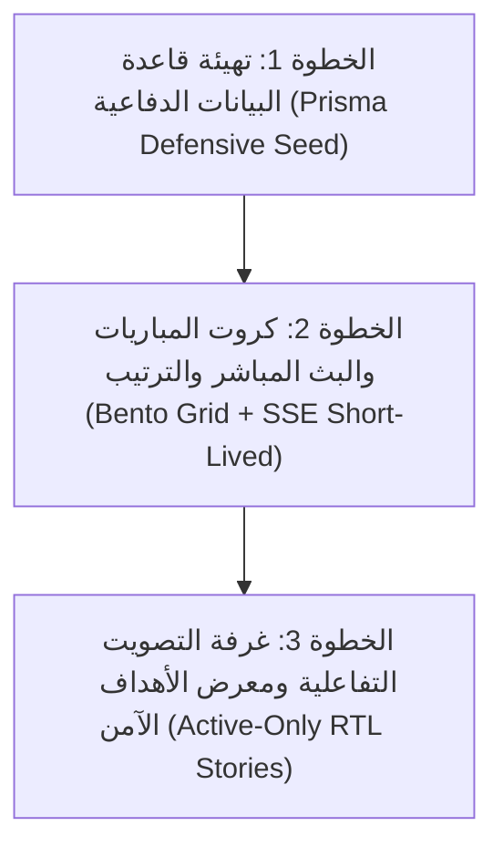

# 🎨 خطة إعادة الهيكلة البصرية والتفاعلية للواجهات (الخطوات 1 و 2 و 3)

هذا الملف هو خريطة الطريق المخصصة والمفصلة لإعادة تصميم وتطوير واجهات الجمهور العامة ونظام التصويت التفاعلي لموقع **نجوم الدوري**، مع سد كافة الثغرات المعمارية وتأمين الأداء وحماية البيانات للتوافق الكامل مع بيئات النشر السحابي (Vercel/Serverless) وبيئة التطوير المحلية (DX).

---

## 🛠️ تفاصيل مسار العمل للخطوات الثلاث المتصلة



---

# 1. الخطوة 1: تهيئة قاعدة البيانات الشاملة والدفاعية (Prisma Defensive Seed)

### 🎯 الهدف
تحديث ملفات البيانات الاختبارية لتغذية واجهات الجمهور الجديدة بالبيانات اللازمة، وتجربة سيناريوهات كسر التعادل والبطولات المؤرشفة، مع الحفاظ على البيانات والإعدادات الإدارية القائمة بالكامل.

### 📁 الملفات المستهدفة بالإنشاء والتعديل
*   #### [MODIFY] [prisma/seed.ts](file:///c:/Users/abodx/Documents/league-stars/prisma/seed.ts)
    *   **تطبيق نمط التهيئة الدفاعي (Defensive Seeding):**
        *   منع استخدام أي جمل مسح مدمرة مثل `deleteMany()` لجدول المستخدمين `User` أو جدول الإعدادات `Setting` و `Content` لتفادي مسح حسابات المشرفين الفعليين أو تدمير تخصيصات الألوان والشعارات.
        *   استخدام عمليات **`upsert`** حصراً لإدراج المستخدم المشرف الافتراضي والبيانات الأساسية؛ بحيث لا يتم تكرار السجل إذا كان موجوداً، ولا يتم مسح التعديلات القائمة.
    *   إضافة سيناريو **البطولة المؤرشفة (Completed Tournament):**
        *   إنشاء بطولة باسم "بطولة نجوم الدوري - الموسم الأول" وحالتها `completed` مع تعيين حقل `archivedAt` بتاريخ من الشهر الماضي.
        *   توليد 8 فرق مشاركة، ومباريات منتهية بالكامل مع تسجيل الهدافين والأهداف لملء معرض الأروايف.
    *   إضافة سيناريو **البطولة النشطة (Active Tournament):**
        *   إنشاء بطولة باسم "دوري النجوم الحالي" وحالتها `active`.
        *   توليد مجموعتين (A و B) تحتوي على فرق متعادلة في النقاط مع فروقات في المواجهات المباشرة والبطاقات لتجربة محرك كسر التعادل (`standings-engine`).
        *   توليد مباريات بحالات متنوعة (`scheduled`, `live`, `finished`).

### ⚙️ أمر التشغيل
```bash
npx prisma db seed
```

---

# 2. الخطوة 2: كروت المباريات والبث المباشر والترتيب (Bento Grid + SSE Short-Lived)

### 🎯 الهدف
تأسيس نظام التصميم البصري الجديد، وإعادة بناء الهوم كـ Bento Grid، وتفعيل تحديثات النتائج بالوقت الفعلي بأداء فائق متوافق مع خوادم الـ Serverless (Vercel).

### 📁 الملفات المستهدفة بالإنشاء والتعديل

*   #### [MODIFY] [src/app/globals.css](file:///c:/Users/abodx/Documents/league-stars/src/app/globals.css)
    *   إضافة أنماط **Bento Grid** ومرونات التجاوب للجوال.
    *   إضافة فئات الـ **Glassmorphism** الفاخرة:
        ```css
        .glass-panel {
          background: rgba(117, 7, 34, 0.12); /* عنابي خفيف */
          backdrop-filter: blur(16px);
          border: 1px solid rgba(255, 255, 255, 0.1);
        }
        ```
    *   إضافة أنيميشن **النبض النيوني النابض** للمباريات المباشرة (`@keyframes neon-pulse`).
    *   إضافة حركة **العداد الدوار ثلاثي الأبعاد** (`3D Flip Counter`) وحركة **وميض الأهداف** (`@keyframes score-flash`).

*   #### [NEW] [src/core/layouts/BottomNav.tsx](file:///c:/Users/abodx/Documents/league-stars/src/core/layouts/BottomNav.tsx)
    *   بناء شريط التنقل السفلي المقوس الفاخر للجوال (Floating Bottom Navigation Sheet) يظهر فقط على مقاسات الشاشات الصغيرة لتسهيل التصفح بالإبهام (يحتوي على أيقونات: الرئيسية، المباريات، الترتيب، التصويت).

*   #### [MODIFY] [src/core/layouts/Navbar.tsx](file:///c:/Users/abodx/Documents/league-stars/src/core/layouts/Navbar.tsx)
    *   **حماية أزرار المشرف على الجوال (Admin Mobile Access):**
        *   تعديل الهيدر ليخفي روابط التصفح التقليدية للزوار العاديين على الجوال (نظراً لنقلها إلى الشريط السفلي).
        *   **القيد المعماري:** يجب عدم إخفاء عناصر التحكم الإدارية؛ عندما يكون هناك جلسة نشطة للمشرف، يعرض الهيدر على الجوال قائمة منبثقة مصغرة (Dropdown) تحتوي على: زر "تفعيل وضع التعديل"، وزر "تسجيل الخروج"، للوصول السلس من الجوال.

*   #### [MODIFY] [src/app/page.tsx](file:///c:/Users/abodx/Documents/league-stars/src/app/page.tsx) (الصفحة الرئيسية)
    *   إعادة تصميم واجهة الهيرو الرياضية وإضافة العدادات الرقمية التفاعلية عند تحميل الصفحة.
    *   إعادة بناء تخطيط الشبكة بالكامل لتصبح **Bento Grid** متفاعلة:
        *   **Widget 1 (البث المباشر):** شريط أفقي قابل للسحب باللمس (Swipeable Matches Carousel) يعرض مباريات اليوم الجارية بحدود تتوهج أحمر وتنبض ديناميكياً.
            *   *قيد التجاوب:* تفعيل حساسية اتجاه اللغة العربية (RTL-aware swipe gestures) لعكس إحداثيات السحب أفقياً وضمان سحب طبيعي ومريح على الجوال.
        *   **Widget 2 (الهداف التاريخي):** بطاقة ثلاثية الأبعاد جذابة تعرض متصدر الهدافين مع خلفية وهج ذهبية.
        *   **Widget 3 (أفضل هدف بالبطولة):** كتلة عريضة تشغل فيديو ترويجي تلقائياً عند مرور الفأرة.
        *   **Widget 4 (الرعاة):** شريط رعاة زجاجي فخم ينساب بشكل دائري.

*   #### [MODIFY] [src/app/matches/page.tsx](file:///c:/Users/abodx/Documents/league-stars/src/app/matches/page.tsx) (صفحة المباريات)
    *   بناء رقاقات التصفية المغناطيسية (Chips) للتصفية اللحظية (الكل | 🔴 مباشر | 📅 قادم | 🏁 منتهي) مع انزلاق ناعم.
    *   تحويل كرت المباراة إلى **مكون متمدد تفاعلي (Expandable Match Card)**؛ عند النقر على المباراة، يتمدد الكرت بانسيابية ليكشف عن:
        *   **محلل المواجهات المباشرة (H2H Analyzer):** رسم بياني يقارن اللقاءات السابقة للفريقين.
        *   **الخط الزمني للأحداث (Event Timeline):** خط رأسي يوضح توقيت الأهداف والبطاقات بأيقونات حية.
    *   ربط الكروت بـ **EventSource** في `use-live-score.ts`؛ لاستقبال التحديثات الفورية وتطبيق تأثير الـ **3D Flip Counter** للرقم المتغير، وإطلاق وميض النيون الأخضر الفوري عند تسجيل هدف.

*   #### [MODIFY] [src/app/scorers/page.tsx](file:///c:/Users/abodx/Documents/league-stars/src/app/scorers/page.tsx) (صفحة الترتيب والهدافين)
    *   **جدول الترتيب التفاعلي:** عند نقر المشجع على اسم أي فريق، يتم تمييز وتلوين صفوف هذا الفريق وتسليط الضوء الفوري على كروت مبارياته في نفس الصفحة لتسهيل المتابعة البصرية.
    *   **منصة تتويج الهدافين (Podium):** تصميم منصة تتويج ثلاثية الأبعاد فخمة للثلاثة الأوائل (🥇 ذهبي، 🥈 فضي، 🥉 برونزي) تبرز كروت اللاعبين مع أعداد أهدافهم وتوهج الهوية البصرية.

*   #### [MODIFY] [src/app/api/live/route.ts] (ممر البث المباشر SSE)
    *   **تطبيق آلية البث المباشر قصير العمر والذاكرة المؤقتة (Short-Lived & Cached SSE):**
        *   **منع DDoSing قاعدة البيانات:** برمجة آلية استعلام موحدة (Ticker) تجلب حالة المباريات الجارية حالياً من قاعدة البيانات مرة واحدة فقط كل 5 إلى 10 ثوانٍ، وحفظ النتيجة في ذاكرة الخادم المؤقتة (Global Cache).
        *   **التوافق مع بيئة Serverless (Vercel Timeout):** نظراً لأن دوال Vercel تقطع أي اتصال مفتوح بعد 15-60 ثانية، سيقوم الممر بإنهاء اتصال البث المباشر بشكل نظيف وتلقائي بعد 45 ثانية من فتحه.
    *   #### [MODIFY] [src/features/matches/hooks/use-live-score.ts] (مستمع البث المباشر عميلاً)
        *   برمجة الـ Hook ليتوقع هذا القطع الدوري والمنظم من السيرفر، وإعادة الاتصال بالـ SSE بصمت وتلقائية بالخلفية دون إشعار المستخدم بأي انقطاع أو إظهار أخطاء في الكونسول.

---

# 3. الخطوة 3: غرفة التصويت التفاعلية ومعرض الأهداف الآمن (Active-Only RTL Stories)

### 🎯 الهدف
تقديم تجربة تصويت تفاعلية آمنة ومشوقة تحفز الجماهير وتعمل بأعلى أداء برمي وخفيف دون إرهاق ذاكرة هواتف الزوار، وتدعم التصفح المحلي المريح والخصوصية التامة.

### 📁 الملفات المستهدفة بالإنشاء والتعديل

*   #### [MODIFY] [src/app/vote/page.tsx] & [src/features/voting/components/GoalGallery.tsx]
    *   إعادة تصميم واجهة التصويت كـ **"غرفة الأهداف" (Trophy Voting Room)** الفخمة ذات الإضاءة المسرحية الموجهة.
    *   بناء **مشغل الأهداف الرأسي للجوال (Instagram-style Stories Video Viewer):**
        *   عرض أهداف الجولة كدوائر متوهجة في الأعلى.
        *   **استراتيجية المكون النشط فقط (Active-Only Rendering):** لمنع شلل متصفحات الجوال واستهلاك الذاكرة والبيانات، سيتم عرض صور مصغرة ثابتة (Thumbnails) لجميع الأهداف في الخلفية، ويتم فقط تحميل وتفعيل مكون مشغل الفيديو (YouTube/Video Frame) للهدف المعروض حالياً أمام المشاهد. عند السحب والانتقال للهدف التالي، يتم فوراً تدمير (Unmount) مشغل الفيديو السابق وبناء الجديد.
        *   *قيد السحب العربي (RTL-aware swipe):* فحص اتجاه الصفحة تلقائياً (`document.documentElement.dir === 'rtl'`) وعكس إحداثيات السحب أفقياً برمجياً لتبدو حركة السحب بين الفيديوهات طبيعية جداً مع حركة إصبع المشجع العربي.
    *   تطوير ميزة **التصويت بالشحن اللمسي (Long Press to Vote):**
        *   عند ضغط المشجع مطولاً على زر التصويت، يدور مؤشر نيون دائري حول الزر يعطي إيحاءً بالشحن.
        *   عند اكتمال الدوران، ينطلق أنيميشن انفجار جزيئي (Particle Burst) رائع لتأكيد تصويته.
        *   **دعم الوصول السريع (Double Tap):** نقر مزدوج سريع للتصويت الفوري كبديل متوافق مع إمكانية الوصول.
    *   **أشرطة تقدم الإحصائيات الزجاجية (3D Progress Bars):**
        *   بعد التصويت، يتم إخفاء خيارات التصويت برفق وعرض إحصائيات ونسب الأهداف كأعمدة زجاجية متوهجة ترتفع تدريجياً لتعكس النتائج الحية.

*   #### [MODIFY] [src/features/voting/actions.ts] (إجراءات التصويت)
    *   **تأمين وحماية عملية التصويت برأس الميزة الهجين (Secure & Hybrid Verification):**
        *   **تخطي عقبة بيئة التطوير (Turnstile DX Bypass Mode):** إذا كان التطبيق يعمل في البيئة المحلية (`process.env.NODE_ENV === 'development'`) ولم يتم تعيين المفتاح السري لـ Turnstile في بيئة العمل، يقبل السيرفر تلقائياً توكن الاختبار الموحد من كลาود فلير (`1x00000000000000000000AA`) لتمكين المطور من تجربة التصويت والشحن اللمسي محلياً بكل يسر ودون مشاكل.
        *   **بصمة الجهاز الهجينة والبديلة (Hybrid Fingerprinting):** في حال قام المشجع باستخدام متصفح خصوصية (مثل Brave أو Safari مع منع التتبع) أو إضافات حجب الإعلانات التي تمنع تحميل كود FingerprintJS، لا يتعطل الموقع بل ينتقل السيرفر تلقائياً لإنشاء بصمة هجينة مشفرة بديلة تعتمد على: `IP Address + User-Agent (نوع الجهاز والمتصفح) + Accept-Language` لضمان عدم حجب أي مشجع حقيقي مع الحفاظ على حماية التصويت.

---

## 🔬 خطة التحقق والقياس لضمان الأداء (Verification Plan)

### 1. التحقق من قاعدة البيانات والـ Seed (الخطوة 1)
*   تشغيل الـ Seed والتحقق من عدم مسح حسابات الأدمن الحالية أو تغيير ألوان الموقع المخصصة، مع رصد إدراج البطولة المؤرشفة والمباراة النشطة بنجاح.

### 2. قياس أداء الـ SSE والـ Reconnection (الخطوة 2)
*   فتح المتصفح ومراقبة نافذة الشبكة (Network panel)؛ يجب التأكد من انتهاء اتصال الـ SSE تلقائياً بعد 45 ثانية، ورصد قيام الـ client-side hook بإعادة الاتصال فوراً بصمت وتلقائية دون إطلاق أي أخطاء أو قطع تجربة النتائج الحية للمستخدم.
*   التحقق من حماية خادم قاعدة البيانات عن طريق التأكد من عدم انطلاق استعلامات متوازية لقاعدة البيانات عند فتح اتصالات متعددة.

### 3. اختبار استهلاك الذاكرة وحركة السحب العربي (الخطوة 3)
*   فتح صفحة التصويت على هاتف جوال، وفحص الـ DOM عبر أدوات المطورين للتأكد من أن وسم الـ `<iframe>` أو `<video>` لا يتم إنشاؤه إلا للهدف المعروض أمام العين فقط، وأنه يُمسح تماماً من الذاكرة فور السحب للهدف التالي.
*   التحقق من أن سحب الفيديوهات لليمين واليسار متوافق تماماً مع اتجاه الكتابة العربي (RTL) ولا يبدو معكوساً.
*   إجراء فحص للتصويت المحلي (Bypass Mode) للتأكد من عمله بنجاح دون الحاجة لمفاتيح Turnstile حية.
